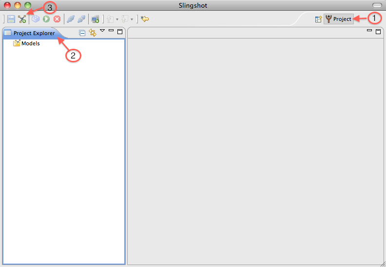
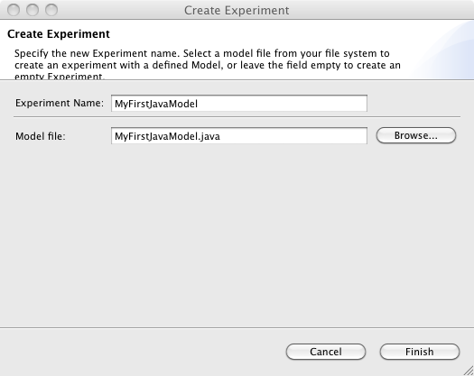

.. meta::
   :description: PrimoGENI User's Guide
   :keywords: PrimoGENI, simulation, emulation, network simulation, network emulation, PRIME, PRIMEX, SSFNet

.. _quick-start-label:

********************************  
Getting Started
******************************** 

This section will show you how to use slingshot to create, deploy and run network models. Also it will show you how to visualize the results and inspect the state of the network model during execution. We will be building the following dumbbell network topology, which contains two subnetworks, each with 4 hosts and one router.

.. image:: images/example_model.png
  :width: 3in

===========================================
Creating the Model
===========================================

In PrimoGENI, one can write a network model in Python, Java, or XML. The latter is normally used by the network topology generators and is therefore not meant for editing directly by the modeler. We start with Java and then move to use Python to develop the same example.

.. _quick-build-java-label:

-------------------------------
The First Java Model
-------------------------------

All Java models must extend :jprime:`ModelInterface  <jprime::util::ModelInterface>` which contains one abstract function, :jprime:`buildModel  <jprime::util::ModelInterface::buildModel>`, which the user is expected to overwrite. Within the buildModel function you are able construct the model for your experiment. In this example we will be constructing the simple dumbbell network shown above.

First, we need to create and edit a java model file, :jprime:`MyFirstJavaModel.java`. You can edit your java file in slingshot directly. We start with some content that looks this:

.. code-block:: java

  import jprime.Experiment;
  import jprime.Interface.IInterface;
  import jprime.Link.ILink;
  import jprime.Net.INet;
  import jprime.Host.IHost;
  import jprime.Router.IRouter;
  import jprime.database.Database;
  import jprime.util.ModelInterface;
  
  public class MyFirstJavaModel extends ModelInterface {
	public MyFirstJavaModel(Database db, Experiment exp) {
		super(db, exp);
	}
	public INet buildModel() {
		return null;
	}
  }

Next we rewrite the :jprime:`buildModel  <jprime::util::ModelInterface::buildModel>` method to create the model. We build the model from top to bottom. First, we use :jprime:`exp <jprime::util::ModelInterface::exp>` to create a top-level network, which we name "top". :jprime:`exp <jprime::util::ModelInterface::exp>` is provided by 
:jprime:`ModelInterface <jprime::util::ModelInterface>` to represent an experiment to be build. We're exepcted to create a top-level network for the expeirment using :jprime:`createTopNet <jprime::Experiment::createTopNet>`, which takes the name of the top-level network as its parameter. Next, we create a subnetwork, called :literal:`left`, within the top-lelvel network. We use the :jprime:`createNet <jprime::gen::Net::createNet>` method, which takes the name of the subnetwork as its argument. 

.. code-block:: java

  ...
  public INet buildModel() {
	INet topnet   = exp.createTopNet("top");
	INet left_net = topnet.createNet("left");
   	return topnet;
  }
  ...

Next we create the four hosts and one router in the left subnetwork and connect the hosts to the router:

.. code-block:: java

  IHost h1 = left_net.createHost("h1");
  IInterface if1 = h1.createInterface("if0");
  
  IHost h2 = left_net.createHost("h2");
  IInterface if2 = h2.createInterface("if0");
  
  IHost h3 = left_net.createHost("h3");
  IInterface if3 = h3.createInterface("if0");

  IHost h4 = left_net.createHost("h4");
  IInterface if4 = h4.createInterface("if0");

  IRouter r = left_net.createRouter("r");

  ILink l1 = left_net.createLink();
  l1.attachInterface(if1);
  l1.attachInterface(r.createInterface("if1"));
  
  ILink l2 = left_net.createLink();
  l2.attachInterface(if2);
  l2.attachInterface(r.createInterface("if2"));
  
  ILink l3 = left_net.createLink();
  l3.attachInterface(if3);
  l3.attachInterface(r.createInterface("if3"));
  
  ILink l4 = left_net.createLink();
  l4.attachInterface(if4);
  l4.attachInterface(r.createInterface("if4"));

Each of the four hosts has a single interface. The router has four interfaces. We then create a link between a host's interface and one of the router's interface.

Since the other subnetwork (on the right) is identical to the left network, we can simply copy it:

.. code-block:: java

  INet right_net = (INet)left_net.copy("right", topnet);

The first argument of the :jprime:`copy <jprime::ModelNode::copy>` method is the name of the subnetwork to be created, and the second argument is parent network, where the new subnetwork is attached to. Note that the  :jprime:`copy <jprime::ModelNode::copy>` method does a deep copy of all sub-elements. That is, the four hosts, the router, the interfaces and the links are all copied.  We also have a memory efficient copying method, called :ref:`replication <architecture-replication-label>`, which is designed for building large models. It can result signficant memory savings, however, at the cost of additional semantic complexity. We ignore it here.

Next, we connect the left and right subnetworks together by creating a link between the two routers:

.. code-block:: java

  ILink toplink = topnet.createLink("toplink");
  toplink.attachInterface(((IRouter)left_net.get("r")).createInterface("if0"));
  toplink.attachInterface(((IRouter)right_net.get("r")).createInterface("if0"));

The :jprime:`get <jprime::ModelNode::get>` method allows you to retrieve child nodes using their names.

By now, we finished our first model, in :jprime:`MyFirstJavaModel.java`. You can go directly to :ref:`quick-slingshot-label`, where we will show you how to view, modify, and execute this model in slingshot.

.. note:: For this example, we do not set any properties (e.g., link bandwidth); the model uses the default. You can use the setter and getter methods for all model properties. You can take a look at the Java API for details on how to do this. For simplicity, we will defer this until we load the model into slingshot.

--------------------------------------------------------------------------------------
The Second Java Model: Adding Routing & Traffic
--------------------------------------------------------------------------------------

Our first model only consists of a network topology. It's missing some critical elements, in particular, network traffic and routing information. In this section, we are going to extend the first model and add traffic and routing. The model will be stored in :jprime:`MySecondJavaModel.java`.

For traffic to flow on a network, the routers and hosts need to know how to forward the packets. The primex simulator, on which we build primogeni, allows the user to specify static routing. Static routing means that all routes are calculated before the model is executed (i.e., during model compilation). In particular, the static routing scheme implemented in primex is called `spherical routing <https://www.primessf.net/bin/view/Public/PublicationsSphericalRouting>`_, where static routes are calculated in units of routing spheres (a sphere is simply a network controlled by the same routing decision). It means the user can simply specify the routing policy to be used for each network. If a network does not specify a routing policy, it is defaulted to use the parent's routing policy. 

Currently the simulator supports three routing policies: shortest-path, BGP, and algorithmic routing. For the sake of simplicity we will use shortest-path routing in this example. To add shortest-path routing for the model, we can simply create one for the top-level network:

.. code-block:: java

  topnet.createShortestPath();

Of course, we can create separate routing policies for different subnetworks. For example, we can add another shortest-path routing to the left subnetwork:

.. code-block:: java

  left_net.createShortestPath();

In general, we recommend adding separate routing to each subnetwork. It can significantly reduce the size of the routing information needed when running the model. This is important when you design large network models.

Next, we will place traffic on the network. The simulator comes with some common traffic types, including:

* Ping traffic (for sending ICMP pings)
* TCP traffic (for downloading data from server to client over TCP)
* UDP traffic (for downloading data from server to client over UPD with constant bit-rate)

Model developers can also add new types of traffic/applications with relative ease. See :ref:`architectural-overview-label` for details. In this example, we'll simply direct two flows. We have the host :samp:`h1` in the left subnetwork to download a 10 MB file from the host :samp:`h2` in the right subnetwork at 10 seconds into the simulation; we also have the host :samp:`h2` in the left subnetwork to download a 10 MB file from the same host :samp:`h1` in the right subnetwork at 13 seconds:

.. code-block:: java

  IHost left_h1 = (IHost)left_net.get("h1");
  IHost left_h2 = (IHost)left_net.get("h2");
  IHost right_h2 = (IHost)right_net.get("h2");
  Traffic.addTCPFlow(topnet, left_h1, right_h2, 100000000, 10);
  Traffic.addTCPFlow(topnet, left_h2, right_h2, 100000000, 13);

The :jprime:`addIperf <jprime::HTTPTraffic::HTTPTraffic::addIperf>` method is a helper function which simplifies adding TCP traffic. The first argument is a reference to the model node where we want to add the traffic specification. This needs to be a network that contains both the client node and the server node (in this case, it's :samp:`topnet`). The second argument is the client node and the third argument is the server node. The fourth argument is the number of bytes to  be downloaded from the server to the client. The last argument is the time at which this traffic action will become active. 

-------------------------------------------
The Third Java Model: Adding Emulation
-------------------------------------------

The two previous models contain purely simulated elements. PrimoGENI supports both simulation and emulation. In this example, we are going to add some emulation capabilities. The model for this example is built on the previous model and stored in :jprime:`MyThirdJavaModel.java`.

An emulated host or router differs from a simulated one in that it can run real applications and protocols on a real machine. Packets generated by the real applications and protocols running on the real node (which may be a virtual machine with a full-fledged operating system) will be intercepted by PrimoGENI and redirected to the network simulator, where they will be added with delays and may get dropped in some cases, according to the simulated network conditions. 

PrimoGENI supports two types of emulation machines (to run the real applications and protocols): remote and collocated. Remote emulation means the real applications are run on a machine different from the machine running the simulator. Collocated emulation means the simulator and real applications and protocols are run on the same machine, although they are in different virtual machines. 

For this example we use the same dumbbell model, but designate host :samp:`h3` both in the left and right subnetworks to be emulated. That is, PrimoGENI will create two virtual machines for the two hosts in the model. To do that, all we need to do is to mark the hosts as emulated:

.. code-block:: java

  IHost left_h3 = (IHost)left_net.get("h3");
  IHost right_h3 = (IHost)right_net.get("h3");
  left_h3.enableEmulation();
  right_h3.enableEmulation();

.. note:: It is important that :samp:`enableEmulation()` is called on a host or router **after** all its interfaces have been created.

In this example, we will start `iperf <http://sourceforge.net/projects/iperf/>`_ traffic between them. Specifically, we will start an iperf server on host :samp:`h3` in the right subnetwork and an iperf client on host :samp:`h3` in the left subnetwork. So that traffic is flowing from right to left:

.. code-block:: java

 EmulationCommand.addIperf(right_h3, left_h3);

The :jprime:`addIperf <jprime::EmulationCommand::addIperf>` method is a helper function that simplifies adding iperf applications on the emulated nodes.

-------------------------------------------
Creating your First Python Model
-------------------------------------------

You can also create models in Python. The following code shows the python code that generates the same model as the first Java model we created earlier. 

.. code-block:: python 

  topnet = exp.createTopNet("top")
		
  left_net = topnet.createNet("left")

  h1 = left_net.createHost("h1")
  if1 = h1.createInterface("if0")

  h2 = left_net.createHost("h2")
  if2 = h2.createInterface("if0")

  h3 = left_net.createHost("h3")
  if3 = h3.createInterface("if0")

  h4 = left_net.createHost("h4")
  if4 = h4.createInterface("if0")

  r = left_net.createRouter("r")
  
  l1 = left_net.createLink()
  l1.attachInterface(if1)
  l1.attachInterface(r.createInterface("if1"))
  
  l2 = left_net.createLink()
  l2.attachInterface(if2)
  l2.attachInterface(r.createInterface("if2"))
  
  l3 = left_net.createLink()
  l3.attachInterface(if3)
  l3.attachInterface(r.createInterface("if3"))
  
  l4 = left_net.createLink()
  l4.attachInterface(if4)
  l4.attachInterface(r.createInterface("if4"))
  		
  right_net = left_net.copy("right",topnet)
  
  toplink = topnet.createLink("toplink")
  toplink.attachInterface(left_net.get("r").createInterface("if0"))
  toplink.attachInterface(right_net.get("r").createInterface("if0"))

.. _quick-slingshot-label:

===========================================
Managing Experiments with Slingshot
===========================================

In this section we are going to briefly go over some important aspects of managing experiments in slingshot. In general, there are six steps to executing a experiment:

1. Create a new experiment and load an existing experiment from database.
2. Modify the network configuration of the model. Slingshot provides an interactive way of dealing with the network model.
3. Compile the model. This step includes pre-calculating routing information, partitioning the model, and preparing for the information needed by the PrimoGENI compute nodes to launch the experiment.
4. Choose and configure an execution environment, on which to run the model.
5. Deploy and run the experiment.
6. Monitor the experiment during run time and collect results for postmortem processing and analysis.

--------------------------------------------
Creating An Experiment
--------------------------------------------

When you first enter slingshot, you'll be presented with the "Project View", as shown below.

The "Project View" contains a "Project Explorer" on the left, which may contain one or more folders, including:

1. **GeneratedModels Folder:** In general, this folder stores the network topologies generated by slingshot's topology generators. See :ref:`slingshot-generator-label` for details on how to generate network topologies.

2. **Project Folders:** Each time an experiment is created a project folder is created to store all data related to the experiment, including arbitrary user files (such as my_notes.txt), and result files. An experiment is also "saved" in the folder. To open an experiment, one can simply double click on the project folder.

You can edit model file in slingshot. There will be an editor window for each open file (as indicated by 3 in the figure above). Slingshot's built-in editor can edit xml, java, and python files with minimal syntax highlighting. 

Slingshot has a :menuselection:`Model` View and a :menuselection:`Project` View. We're right now in the Project View, as indicated by 4 in the figure above.

To create a new experiment, you can select from the menu: :menuselection:`File --> Create Experiment`, or simply by clicking the button next to the disk icon, as shown here:

.. image:: images/slingshot_new_exp.png
  :width: 7in

You will then be prompted with a dialog asking for the name of the new experiment and the model file to start with. 

In this example, we use "MyFirstJavaModel" as the :menuselection:`Experiment Name` and select :jprime:`MyFirstJavaModel.java` for the :menuselection:`Model file`. After you click :menuselection:`Finish`, a new experiment will be created; a new folder will also be created with the name "MyFirstJavaModel". After the model has been properly imported, slingshot will change to the "Model View", which is shown below.

.. image:: images/slingshot_modelview.png
  :width: 7in

1. **Network Graph:** The topology of the network model is displayed as an interactive graph. Different node types have different shapes (for example, a host is shown as a rectangle and a router is shown as a circle). When a node is selected by mouse, it is highlighted in red. 

2. **Attribute Tree:** The attribute tree allows you to explore the detailed configuration of each model node (i.e., network component), such as assigned IP address of a network interface card in a host, or a link's bandwidth. When the experiment is being executed, the values under :menuselection:`runtime state` will be updated in real time, so you can monitor the network transactions.

3. **Jython Console:** In the console you are able to inspect and modify the network model using `python <http://python.org>`_. One can use the console to make changes to the network model programmatically.
 
4. **Log:** Informational, warning, and error messages will be displayed here. 

5. **Views:** Slingshot has a :menuselection:`Model` View and a :menuselection:`Project` View; we're current in the Model View.
 
6. **Basic Controls:** The left icon is to save the current experiment and the right icon is to create a new experiment.

7. **Experiment Controls:** The left icon compiles the model (after a model is compiled it cannot be modified). The middle icon executes the experiment after compilation. The right icon stops the running experiment.

8. **Asynchronous Controls:** These controls allow you to attached and detach slingshot from an active experiment. Currently this functionality is not supported.

9. **Create/Edit Execution Environment:** The button is used to create a new execution environment, or to edit or delete an existing execution environment. An execution enviornment contains detailed specification of the platform on which we will run the expeirment.

10. **Visualization Controls:** The first icon redraws the network graph; the second button pauses the real-time update of the network graph (to save CPU time); the third button adds a graph overlay (which is expected to draw on the network graph to show important information, such as the path found by traceroute); and the last button clears out the graph overlays. 

11. **Experiment Controls:** The left icon compiles the model. The middle icon executes the experiment. The right icon graphs the runtime state of the currently selected node in realtime using `LiveGraph <http://www.live-graph.org>`_.

12. **Console Controls:** The left icon saves the commands typed in the Jython Console and the right icon allows one to load a set of commands stored in a file to the Jython Console.

--------------------------------------------
Modifying Network Configurations
--------------------------------------------

Nearly all model elements, including hosts, router, network interfaces, and links have properties which can be changed. We can either change the network configuration in the Attribute Tree or the Jython Console. 

Let's first select a host clicking the corresponding node in the Network Graph. In this case, let's suppose we select host :samp:`h3` in the right subnetwork.

  .. image:: images/slingshot_edit.png
    :width: 7in

You can reference the currently selected node in the Jython Console using :samp:`sel`. For example, you can get the name of the selected network component (both relative name and the fully qualified name):

.. code-block:: python

  >>> sel.getName()
  u'h3'
  >>> sel.getUniqueName()
  top:right:h3
  >>> 

You can get the reference to a child model node using the :samp:`sel.get()` method with its name as the argument. For example, you can get the network interface of the currently selected node (there's only one for this host). Once we have that, we can certain change the properties of the model node if wanted. In the following, we change the bit rate of the network interface to be 10 Mb/s:

.. code-block:: python 

  >>> if0 = sel.get("if0")
  >>> if0.setBitRate(1e8)
  >>> if0.getBitRate()
  1.0E8
  >>>

You can simply do the same on the Attribute Tree, which shows all the properties associated with the currently selected node. If the attribute can be modified, you can double click on the attribute entry and then enter the new value directly. However, the Jython Console provides a programmable interface to the model configuration, which is more powerful than the Attribute Tree.

In the following, we use the Jython Console to create two more subnetworks (which are exact copies of the existing two) and link them together with the existing subnetworks:

.. code-block:: python 

  >>> left_net = topnet.get("left")
  >>> n1 = left_net.copy("third", topnet)
  >>> n2 = left_net.copy("fourth", topnet)
  >>> toplink = topnet.get("toplink")
  >>> toplink.attachInterface(n1.get("r.if0"))
  >>> toplink.attachInterface(n2.get("r.if0"))
  >>>

Here, :samp:`topnet` refers to the top-level network. First, we get a reference to the left subnetwork using the get method with the name of the subnetwork "left". We then create two copies of the same subnetwork. Next we get a reference to the link connecting the left and right subnetworks, which is named as "toplink".  We attach two more interfaces to the link; that is, we create a switch with multiple ports that connect to the interface "if0" of the router "r" of all four subnetworks. 

--------------------------------------------
Compiling the Experiment
--------------------------------------------

Once the model has been created and configured properly. It's time to compile the model. This step includes:

* assigning unique ids to all network components
* assigning ip and mac addresses to network interfaces
* pre-calculating static routing information
* partitioning the model if for parallel network simulation
* preparing for the information necessary for the compute nodes to launch the experiment

Also, this step involves a lot of work; from the user's point of view it's quite simple. All you'd need to do is click the :menuselection:`Compile` button in the Model View, or select from the menu: :menuselection:`Experiment --> Compile Experiment`. 

Once a model is compiled, you cannot make structural modifications to the model, such as adding a host, interface or link. You can still change the properties of the model, such as changing the link bandwidth.

---------------------------------------------------------------
Creating and Configuring the Execution Environment
---------------------------------------------------------------

Currently, Slingshot supports three types of execution environments:

* **Local Machine:** This environment can only execute models that contain simulated elements (i.e. no emulation!).
* **Remote Cluster:** This environment assumes that the cluster has been setup to execute PrimoGENI experiments. It differs from the PrimoGENI environment below in that we do not assume the cluster has implemented the GENI api. If you have already allocated a GENI *slice* and the compute nodes are running the PrimoGENI OS image you could run experiments on the slice using this environment type.
* **PrimoGENI:** This environment uses the `ProtoGENI <http:://www.protogeni.net>`_ api to allocate a resource *slice* to execute the experiment. It assumes that the chosen ProtoGENI cluster has the correct PrimoGENI OS image. 

Previously we created three models: :jprime:`MyFirstJavaModel.java`, :jprime:`MySecondJavaModel.java`,  and :jprime:`MyThirdJavaModel.java`. The first two models contain purely simulated elements and thus can be executed on any environment type. The third model must be executed on a "Remote Cluster" or "PrimoGENI" environment since it has emulation. Below are details on how to execute :jprime:`MySecondJavaModel.java` and :jprime:`MyThirdJavaModel.java`

%%%%%%%%%%%%%%%%%%%%%%%%%%%%%%%%%%%%%%%%%%%%%%%
MySecondJavaModel
%%%%%%%%%%%%%%%%%%%%%%%%%%%%%%%%%%%%%%%%%%%%%%%

We are going to execute this model using the local simulator. To do that we first need to create a "Local Machine" environment. To do that we need to:

1. Click on the :menuselection:`Create New Environment` icon (see :ref:`quick-slingshot-modelview-label` if you don't know where that is).
2. In the :menuselection:`Environment Name` field you can choose whichever name you like, we have chosen "Local" as seen here:

  .. image:: images/slingshot_local_1.png
    :width: 4in

3. Click :menuselection:`Next`.

4. Specify the :menuselection:`Number of Processors`. For this demo we are going to use 1 processor as seen here:

  .. image:: images/slingshot_local_2.png
    :width: 4in

5. Click :menuselection:`Finish` and the environment will be created.

Now we can execute the experiment. To do that we need to:

1. Click on the :menuselection:`Execute Experiment` icon (see :ref:`quick-slingshot-modelview-label` if you don't know where that is). 
2. You should now see the following dialog:
 
  .. image:: images/slingshot_local_3.png
    :width: 4in

  There a few things to explain here:

   * **Environment:** The environment which we want to execute the experiment on.
   * **Runtime:** How long to run the experiment for.
   * **Pace Simulation Speed:** Because simulation can execute much faster than real-time we may want to slow down how fast the experiment is executed. If we use :samp:`0` the simulator will run as fast as possible. If we use :samp:`0.5` the simulator will run half as fast as real-time. And if we use :samp:`1` the simulator will run in real-time.
   * **Visualize State Updates:** As the experiment is executed the simulator can export state changes to Slingshot for visualization. For very intense models this overhead could be quite high so we have the option to disable it.

3. Click :menuselection:`Finish` and the model will start executing. The color of the nodes will change in response to the their traffic intensity as seen here:

  .. image:: images/slingshot_local_4.png
    :width: 7in

The warmer the color the higher the intensity.

4. Also notice that the :menuselection:`runtime state` has changed for nodes which had traffic pass through them.

5. While the model is executing, choose one of the nodes which has traffic and click on the :menuselection:`Live Graph` icon (see :ref:`quick-slingshot-modelview-label` if you don't know where that is). You should something like this:

  .. image:: images/slingshot_local_5.png
    :width: 7in
	

%%%%%%%%%%%%%%%%%%%%%%%%%%%%%%%%%%%%%%%%%%%%%%%
MyThirdJavaModel
%%%%%%%%%%%%%%%%%%%%%%%%%%%%%%%%%%%%%%%%%%%%%%%

.. note:: If you have no idea what ProtoGENI or GENI are it might be best if your first visit the `ProtoGENI Tutorial <http://www.protogeni.net/trac/protogeni/wiki/Tutorial>`_.

To execute :jprime:`MyThirdJavaModel.java` we are going to use the Utah ProtoGENI site. To do that we need to:

1. Get a `Utah Emulab <http://www.emulab.net/>`_ account. 
2. Generate a SSL certificate

  1. Log onto your `emulab <http://www.emulab.net/login.php3>`_ account.
  2. Follow the :menuselection:`My Emulab` link in the upper left of the page.
  3. Select the :menuselection:`Profile` tab (the rightmost of the three).
  4. Follow the :menuselection:`Generate SSL Cert` link.
  5. Fill out the form and submit.
  6. Download your SSL cert (we will need this for the PrimoGENI environment).

3. Setup SSH keys

  1. This is necessary if you want to log into your compute nodes. 
  2. Follow these `instructions <http://www.protogeni.net/trac/protogeni/wiki/Tutorial#SSHKeys>`_ to generate your keys.

Now we have an emulab/protogeni account we can setup our PrimoGENI environment in slingshot:

1. Click on the :menuselection:`Create New Environment` icon (see :ref:`quick-slingshot-modelview-label` if you don't know where that is).
2. In the :menuselection:`Environment Name` field you can choose whichever name you like. We have chosen "UtahProtoGENI" as seen here:

  .. image:: images/slingshot_pg_1.png
    :width: 4in

3. Click :menuselection:`Next`.

4. Fill out this form:

  .. image:: images/slingshot_pg_2.png
    :width: 4in

  * **Certificate File:** the SSL certificate you generated and download from emulab.
  * **Passphase:** the passphrase you used when you generated your SSL certificate.
  * **# of Compute Nodes:** For this demo we will be using 1 compute node.

4. Click :menuselection:`Finish` and the environment will be created.

Now we can execute the experiment. To do that we need to:

1. Click on the :menuselection:`Execute Experiment` icon (see :ref:`quick-slingshot-modelview-label` if you don't know where that is). 
2. You should now see the following dialog:
 
  .. image:: images/slingshot_pg_3.png
    :width: 4in

  * Select the UtahProtoGENI environment we previously created.
  * Enter 120 seconds as the runtime.
  * Choose a unique slice name; the slice name it used by ProtoGENI to identify the resources allocated to this experiment.

3. Click :menuselection:`Finish`. 

  * Unlike the other environments, PrimoGENI environments must first allocate and configure the compute nodes at the Utah site before the nodes can execute our experiment.
  * The status of your slice will be printed to the log during the process.
  * This process can take a very long time. Be patient.

4.  After the slice has been allocated and provisioned, Slingshot automatically creates a new environment which refers to the slice. You will see a dialog like this:

  .. image:: images/slingshot_pg_4.png
    :width: 4in

  * You will be able to redeploy experiments to this environment. 

5. You will be notified once the experiment has begun execution. You will see a dialog like this:

  .. image:: images/slingshot_pg_5.png
    :width: 4in

  .. note:: Sometimes the nodes do not all boot fast enough and the meta-controllers at all of the compute nodes are not ready. If this happens the experiment may fail to start. Don't worry, your time was not wasted. Just redeploy the experiment using the automatically created environment.

6. To release the slice resources you need to delete the environment that was automatically created in step 4. When you delete the slice you will see this dialog:

  .. image:: images/slingshot_pg_6.png
    :width: 4in

  If you do not have Slingshot release the slice for you then you must do so manually!
