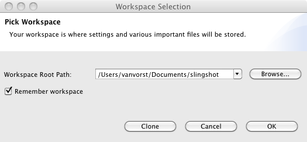
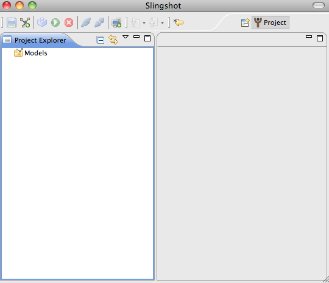
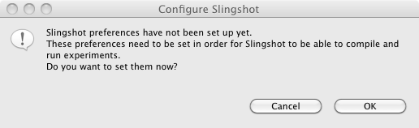
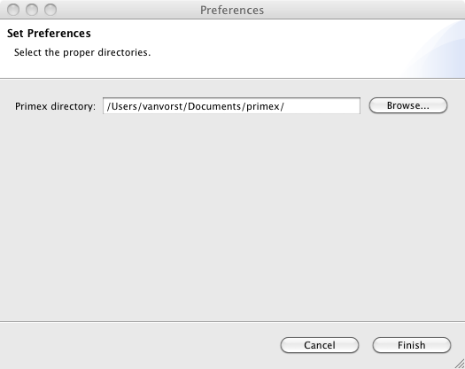
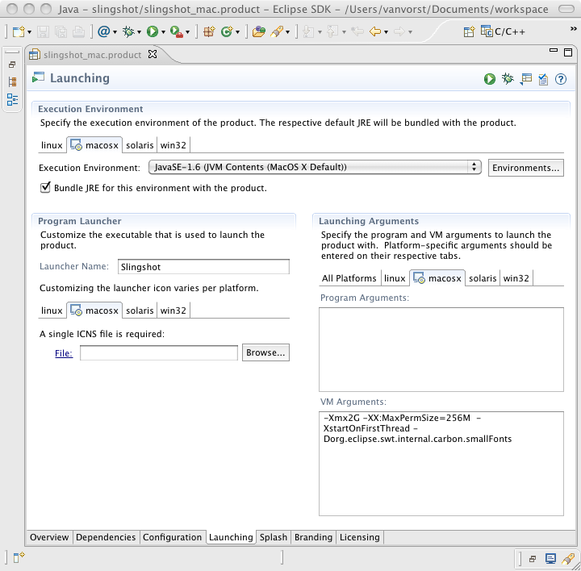

.. meta::
   :description: PrimoGENI User's Guide
   :keywords: PrimoGENI, simulation, emulation, network simulation, network emulation, PRIME, PRIMEX, SSFNet

.. _install-label:

************
Installation
************

.. _slingshot-requirements-label:

===========================================
Getting Help
===========================================

If you have trouble downloading, using, or installing PrimoGENI you can email :literal:`help@primessf.net` for assistance. 

===========================================
Requirements
===========================================

------------------------------
Operating Systems
------------------------------

  * Linux (x86, x86_64)
  * OSX (x86, x86_64)

.. _eclipse-install-label:

------------------------------
Required Software
------------------------------

The following software packages are required by PrimoGENI:

* **GCC**: A recent version of the GNU C/C++ Compiler (>=4.2) is required to build the PRIMEX simulator (which is the parallel real-time network simulator implemented in C++).

* **Java 6**: Java (version 6) is required by both jPRIME (which is the Java modeling framework for the simulator) and slingshot (which is an IDE for developing PrimoGENI models). It is recommended that you use `Oracle's JDK <http://www.oracle.com/technetwork/java/index.html>`_ as there might be compatibility issues with OpenJDK and GNU-Java. 

* **Python 2.6**: Python (version 2.6) is used by the Meta-Controller to communicate with GENI resources.

* **flex**: A lexical analyzer generator used to create the internal parser.

* **bison**: A parser generator (like yacc) used to create the internal parser.

* **ant**: Used to build the java aspects of PrimoGENI. 

The following software packages are optional:

* **MPI**: Message Passing Interface (MPI) is used for running the simulator on distributed-memory machines; it's not needed if you only need to run sequential simulations. 

* **Doxygen**: The API reference in the user documentation is generated using `doxygen <http://www.stack.nl/~dimitri/doxygen/index.html>`_. Doxygen is a source code documentation generator for C++ and Java.  In general, you don't need to install doxygen, because PrimoGENI documents are available online at `http://www.primessf.net/PrimoGENI <http://www.primessf.net/PrimoGENI/>`_. But if you want to generate this document from the source code distribution, you need to have doxygen properly installed. 

* **Sphinx**: This document is generated using `Sphinx <http://sphinx.pocoo.org/>`_. Sphinx is a python documentation generator that uses a markup language, called `reStructuredText <http://docutils.sourceforge.net/rst.html>`_.  In general, you don't need to install sphinx. You need to have sphinx properly installed only if you want to generate this document from the source code distribution. Sphinx is available as an easy-installable package on the Python Package Index.

* **Doxylink**: This document links to the API reference using `doxylink <http://pypi.python.org/pypi/sphinxcontrib-doxylink>`_. Doxylink manages the URL mapping from the class and function names in this document to the API reference document.  In general, you don't need to install doxylink. You need to have sphinx properly installed only if you want to generate this document from the source code distribution. Doxylink is available as an easy-installable package on the Python Package Index.

   .. note:: On Mac, a problem occurs with pip (i.e., py26-pip) when installing doxylink. Using `easy_install <http://pypi.python.org/pypi/setuptools>`_ seems to be able to solve this problem. Also, we found a problem with doxylink.py; we have reported the problem, but you can use the updated `doxylink.py <https://www.primessf.net/pub/Public/PrimoGENIProject/doxylink.py>`_ to replace the original (the location depends on your python 2.6 installation; on my mac, it's :literal:`/Library/Python/2.6/site-packages/sphinxcontrib_doxylink-1.1-py2.6.egg/sphinxcontrib/doxylink/doxylink.py`).

* **dvipng**: This document uses `dvipng <http://savannah.nongnu.org/projects/dvipng/>`_ to generates PNG version of mathmatical expression for inclusion within the HTML version of the manual pages. In general, you don't need to install dvipng. You need to have sphinx properly installed only if you want to generate this document from the source code distribution. 

* **Eclipse**: A recent version of Eclipse with following plugins is required to build slingshot (which is the IDE for PrimoGENI). In general, you don't need it if you use the slingshot product (which is a precompiled program for your platform) and you can download the pre-packaged slingshot from `http://www.primessf.net/PrimoGENI <http://www.primessf.net/PrimoGENI>`_. But if you want to create slingshot from the source code distribution, you need to have eclipse properly installed. You can get the latest eclipse distribution from: `http://www.eclipse.org/downloads/ <http://www.eclipse.org/downloads/>`_. Specifically, use "Eclipse IDE for Java Developers". You would also need to following eclipse plugins (under :menuselection:`Help --> Install New Software`):

  * You need to install the **Eclipse Rich Client Platform**. This is usually installed already. Uncheck :menuselection:`Group items by category` to see if it's in the list.
  * You need to install the **Eclipse Plug-in Development Environment**. This can be found under *General Purpose Tools* when :menuselection:`Group items by category` is checked.
  * You need to install an external plugin called `Afae <http://robrohan.com/projects/afae>`_. To install Afea go to :menuselection:`Help --> Install New Software` in eclipse and use `http://robrohan.com/projects/afae <http://robrohan.com/projects/afae>`_ as the software url. When the software lists loads make sure you uncheck :menuselection:`Group items by category` and select the :menuselection:`Main Editor` option. It is best to restart eclipse after installing this plugin.

   .. note:: We have often experienced problems with installing this plugin from the eclipse update site. If you cannot install it from the eclipse update site, you can download the plugin `here <https://www.primessf.net/pub/Public/PrimoGENIProject/afae_plugins.tgz>`_. Untar afae_plugins.tgz as ':samp:`tar -zxf afae_plugins.tgz`' and move :literal:`com.rohanclan.afae_1.2.0`, :literal:`com.rohanclan.imageviewer_0.9.1`, and :literal:`com.rohanclan.snippets_0.8.8` to the plugins folder of your eclipse installation. You need to restart eclipse after doing this.

   .. note:: We have had problems with the latest Eclipse versions. In order to avoid that we include a working version for 
             Linux 32-bit `HERE <http://users.cis.fiu.edu/~meraz001/slingshotfiles/eclipse_linux32bit.tgz>`_, and
             a version for mac `HERE <http://users.cis.fiu.edu/~meraz001/slingshotfiles/eclipse_mac.tgz>`_ .
             Just download and untar those files and run eclipse executable.  

===========================================
Obtaining Source Code
===========================================

PrimoGENI is open source. There are two ways to obtain the PrimoGENI source code.
You can get the software as a zipped tarball `HERE <http://users.cis.fiu.edu/~meraz001/slingshotfiles/primex.tgz>`_.
You can untar the source using::

   % tar xvzf primex.tar.gz

Alternatively, You can use subversion to check out the latest code from our
repository. The username for anonymous access is :literal:`guest` with password :literal:`guest`. You can get the latest source code using::

   % svn co https://svn.primessf.net/repos/primex/trunk primex

.. note:: **IMPORTANT!!!** if you use svn for downloading the latest version you will be able to use the latest features of primex
          in your local machine. If you intend to conduct emulation experiments in Emulab, then you must use the tarball provided
          above since that version is synchronized with the current OS image in Utah Emulab/protoGENI. 

The latest release version is available using::

   % svn co https://svn.primessf.net/repos/primex/tags/latest primex

To see what versions are available for download you can use::

   % svn ls https://svn.primessf.net/repos/primex/tags

.. note:: It is recommended that you stick with the latest release. The code in trunk is updated on a daily basis and may not work as is. We make sure that the simulator running on the PrimoGENI cluster matches with the "latest" release from SVN.

Using either method, a new directory, called ``primex``, will be created
under the current directory. The source is composed of the following major sub-folders:

* **primex/netscript** :  This folder contains the source for the jPRIME and Meta-Controller Java packages.
* **primex/netIDE** : This folder contains the source for the slingshot IDE.
* **primex/netsim** : This folder contains the source for the PRIMEX network simulator.
* **primex/topology** : This folder contains network topology generators used by slingshot.
* **primex/doc** : This folder contains this document.
* **primex/test** : This folder contains a test framework for jPRIME and PRIMEX.

.. _slingshot-configuration-label:

===========================================
Configuring the Simulator
===========================================

PrimoGENI uses autoconf tools to customize the software before building
it. The simplest way to configure PrimoGENI is::

   % cd primex/netsim
   % ./configure 

.. note:: **IMPORTANT!!!** For now, you need to do "./configure --disable-ssfnet-openvpn" instead of "./configure" if you get the software by checking out the "latest" version from svn. We will synchoronize it with the latest version (the current trunk version) soon. After the synchoronization, you will not need to specify "--disable-ssfnet-openvpn". 

.. note:: **IMPORTANT!!!** The **JAVA_HOME** environment variable must be specified for configure to work. **JAVA_HOME** must point to the root of the JDK installation.

   - Modern Linux distributions typically place Java JDKs in :literal:`/usr/lib/jvm/<your JDK>`. If you have chosen the Oracle/Sun JDK it would be :literal:`/usr/lib/jvm/java-6-sun`.
   - On OS X the JDK is stored at :literal:`/System/Library/Java/JavaVirtualMachines/1.6.0.jdk/Contents/Home` ( assuming you have Java 1.6.0 ).

If you need to change the compiler flags, for example, if you want to
enable the debugging information helpful to the debugger and turn on
all compiler warnings, you can add the following options::

   % ./configure CXXFLAGS="-O0 -g -Wall" CFLAGS="-O0 -g -Wall"

To find all of the configuration options use::

   % ./configure --help

===========================================
Compiling the Simulator
===========================================

After configuration is properly completed you can build PrimoGENI
using::

   % cd primex/netsim
   % make ssfnet-jprime
   % make ssfnet
   % cd ../netscript
   % ant jar
   % cd ../topology
   % make all

.. note:: **IMPORTANT!!!** Some systems have problems compiling gt-itm under topology:
		  *make[2]: Leaving directory `/root/primefordocs/primex/topology/gt-itm/sgb'*
		  *gcc -I../include -I../sgb -o ../bin/itm itm.o geog.o ts.o dfs.o -L../sgb -lgb -lm*
		  */usr/bin/ld: skipping incompatible ../sgb/libgb.a when searching for -lgb*
		  */usr/bin/ld: cannot find -lgb*
		  *collect2: ld returned 1 exit status*
		  
		  If you get the error shown above and cannot overcome this, 
		  then you can erase *cd gt-itm/src && $(MAKE) $@* from Makefile and
		  the other models will compile with no problem. 

If you rebuild PrimoGENI from a previous installation, it's a good idea
to restore a clean distribution beforehand::

   % cd primex/netsim
   % make distclean
   % cd ../netscript
   % ant clean

.. _slingshot-running-label:

=========================================== 
Obtaining and Running Slingshot
===========================================

There are two ways to obtain slingshot. The first one, which is an easier option,  is to download a pre-packaged slingshot executable from `http://www.primessf.net/PrimoGENI/ <http://www.primessf.net/PrimoGENI/>`_. After you download the slingshot version for your platform, you can just untar it using::

  % tar -zxf slingshot-<version>-<platform>.tgz

and an Eclipse Product will be extracted to the *slingshot* directory. To run it just open *slingshot/slingshot*. If you choose this option, you can skip the following sections and jump directly to  :ref:`slingshot-firstrun-label`. 

The second option, which is a more elaborate path, is to compile slingshot directly from the source code. To do that you need to install eclipse beforehand. The instructions for installing eclipse and its plugins are given in the :ref:`eclipse-install-label` section. After that, you need to create a new project for slingshot. 

--------------------------------------
Creating a Project for Slingshot
--------------------------------------
 
Run eclipse and follow the steps below:

* Within eclipse select :menuselection:`File --> New Project` and select :menuselection:`Java Project` from the wizard list.
* Choose a name for the project and browse to the netIDE folder on the PrimoGENI source that was downloaded or checked-out above. It should look something like this:

  .. image:: images/slingshot_newproject.png
    :width: 5in

* Click :menuselection:`Next` and then click :menuselection:`Finish` to create the project.
* Within the *Project Explorer* you should now see your Slingshot project. You should see a number of folders and files. Among them should be:
   * slingshot_mac.product
   * slingshot_linux_64.product
   * slingshot_linux_32.product

  Open the one which matches your platform. You should see something like this if you have the RCP correctly installed:

  .. image:: images/slingshot_run.png
    :width: 6in

* Before we can run slingshot we need to make sure we have the dependencies. To do that click on the :menuselection:`Dependencies` tab at the bottom on the page. Scroll through the list and make sure none of them have a red "x" next to them. For example, on my Mac I don't have the Linux libraries so when I open slingshot_linux_64.product I see this in my list:

  .. image:: images/slingshot_missing.png
    :width: 3in

 If you have any missing dependencies you must resolve them before you can compile or run slingshot.

* Click the green "play" button at the top left of the page to start slingshot. If you have all the dependencies you should see:

  .. image:: images/slingshot_splash.png
    :width: 4in

* The first time you run slingshot you will need to configure it; :ref:`slingshot-firstrun-label` has details on what you need to do.

.. _slingshot-firstrun-label:

--------------------------------------
Running Slingshot The First Time
--------------------------------------

The very first time slingshot is run, slingshot asks you to create a workspace to store its meta-data, experiments, and data. You should see:

You can set up the workspace wherever you want it. If you do not check "Remember Workspace", slingshot will prompt you to select your workspace each time it is run. 

.. note:: If you run slingshot from a slingshot product (not from within eclipse) you will not be prompted to set up the workspace. It will automatically create one for you at a default location. To change the location, select :menuselection:`File --> Switch Workspace`.

You should now see:

and

Click :menuselection:`OK` and you will see:

Find the directory where you downloaded or checked-out PrimoGENI above and then click :menuselection:`Finish`. If you want to change this at a later time, you can do that by selecting :menuselection:`Tools --> Slingshot Config Wizard`.

.. note:: If you downloaded a pre-packaged slingshot you need to have the latest primex release, which is set to match with the slingshot product. Now the latest version is the trunk under primex project in svn, we will synchronize the trunk version to latest version soon.

-------------------------------------
Adjusting Memory Limits
-------------------------------------

By default, slingshot is set to use 2 GB of memory. It must be at least 512 MB. Also, the max permanent size should be at least 128 MB. In normal cases, you don't need to set these parameters. However, in case you need to, you can change the memory limits by selecting the :menuselection:`Launching` tab in eclipse, as illustrated here:

You can change the :samp:`-Xmx2G` and :samp:`-XXMaxPermSize=256M` strings in the :menuselection:`VM Arguments` section to adjust the amount of memory used by slingshot.

.. note:: If you are using a pre-packed slingshot for linux platforms, you can directly change these paraemters in the :literal:`Slingshot.ini` file located in the :literal:`slingshot` directory.

--------------------------------------
Creating a Slingshot Product
--------------------------------------

Typically, you don't need to go through this step. But in case you want to create an eclipse product, it is pretty simple. Just follow a few steps:

* Within the *Project Explorer* you should now see your Slingshot project. You should see a number of folders and files. Among them there should be:

  * slingshot_mac.product
  * slingshot_linux_64.product
  * slingshot_linux_32.product

  Open the one that matches your platform. You should see something like this if you have the RCP correctly installed:

  .. image:: images/slingshot_run.png
    :width: 6in

* Select the :menuselection:`Eclipse Product export wizard` and you should see:

  .. image:: images/slingshot_export.png
    :width: 6in

* Choose where to store the slingshot product and then click :menuselection:`Finish`. After that you should see a folder called "MySlingshotProduct" if you used the same name as I did. If you open the folder there will be two sub-folders: *slingshot* and *repository*. The *slingshot* folder is the standalone version of slingshot. To run slingshot from here simply double click (execute) on "Slingshot". 

  .. image:: images/slingshot_product.png
    :width: 6in

Your now ready to start using primogeni to build and run your first experiment! :ref:`quick-build-java-label` contains a quick-start guide to help you get a hands-on experience with primogeni.

=========================================== 
Generating Documentation
===========================================

All PrimoGENI user documents are available online at `http://www.primessf.net/PrimoGENI <http://www.primessf.net/PrimoGENI/>`_. However, if you want to create this document or the reference APIs, that come along with the source-code distribution, you need to follow the steps below::

   % cd primex/netsim
   % make ssfnet-jprime
   % cd ../doc
   % make html
   % make latexpdf

The resulting documents are produced:

* **primex/doc/build_/html/index.html** : the index page of this document.
* **primex/doc/build_/latex/PrimoGENI.pdf** : the PDF version of this document.
* **primex/doc/build_/doxygen/jprime/index.html** : the index page of the jPRIME API.
* **primex/doc/build_/doxygen/meta-controller/index.html** : the index page of the meta-controller API.
* **primex/doc/build_/doxygen/slingshot/index.html** : the index page of the slingshot API.
* **primex/doc/build_/doxygen/ssfnet/index.html** : the index page of the primex simulator API.

