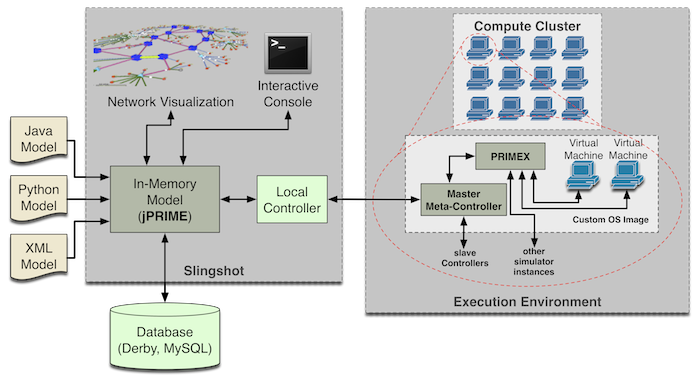
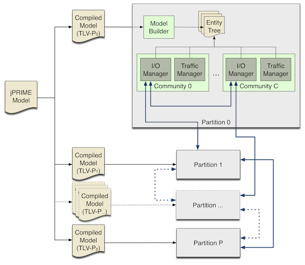
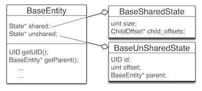

.. meta::
   :description: PrimoGENI User's Guide
   :keywords: PrimoGENI, simulation, emulation, network simulation, network emulation, PRIME, PRIME, SSFNet

.. _architectural-overview-label:

******************************** 
Architectural Overview
******************************** 

=================================
High-Level Architecture
=================================

PrimoGENI is composed of five major components:

  * The :ref:`architecture-ssfnet-label` network simulator.
  * PRIMEX's modeling framework, :ref:`architecture-jprime-label`.
  * The :ref:`architecture-meta-controller-label`.
  * :ref:`architecture-slingshot-label`.
  * A ProtoGENI/Emulab :ref:`architecture-os-image-label`.

Below is high-level view of how these components are configured to implement PrimoGENI.

On the far left of the diagram there are models which are loaded into Slingshot using jPRIME. jPRIME manages the model and acts as a intermediary to the database, visualization libraries, and interactive console. The local controller compiles the jPRIME model, configures the compute cluster, and deploys the compiled model to the meta-controllers running on our custom OS image on the compute nodes which will execute the model. 

.. _architecture-ssfnet-label:

=================================
PRIMEX
=================================

PRIMEX is the successor to `PRIME <http://www.primessf.net/PRIME>`_ (Parallel Real-time Immersive network Modeling Environment). PRIMEX, like PRIME, uses the `scalable simulation framework <https://www.primessf.net/bin/view/Public/SSFUsersManual>`_ (SSF) as its simulation kernel. In general, PRIMEX follows the same structure as PRIME. However, PRIMEX is built on a completely new code-base and does not provide backwards compatibility with old DML based models. 

--------------------------------------------------
Basic Structure
--------------------------------------------------

Network experiments (aka network models) are composed of sub-models such as hosts, routers, links, protocols and applications. Developers implement these sub-models within PRIMEX and jPRIME allows experimenters to configure these sub-model within the larger experiment.  Within PRIMEX network models are composed of *network entities*. All network entities are derived from the base class :ref:`architecture-primex-base-entity-label`. Within PRIMEX the network model is live as a tree of network entities. The following diagram depicts the high-level architecture of PRIMEX.

Partitioning is done is two basic steps. First, the model is partitioned into *P* model fragments, where *P* is the number of compute nodes the model will be executed on. The second step is the partition each fragment into *C* communities, where *C* is the number of processors on the compute node. Each community acts as an SSF timeline which is executed in its own thread. All of the communities within the same model fragment will be executed on the same compute node. Each model fragment is compiled into a TLV file. A TLV is a packed format for model which is used by the :primex:`model builder <prime::ssfnet::ModelBuilder>` to construct the entity tree within each PRIMEX instance. Further details on partitioning can be found in :ref:`architecture-jprime-parting-label` and :ref:`architecture-primex-parting-label`.

There will be a single PRIMEX instance run on each partition and if that partition has multiple communities PRIMEX will execute each community in its own thread. Within each community there are two important components: the :primex:`I/O manager <prime::ssfnet::IOManager>` and the :primex:`traffic manager <prime::ssfnet::TrafficManager>`. The :primex:`I/O manager <prime::ssfnet::IOManager>` is responsible for exchanging events with other communities as well as importing and exporting events with real entities (i.e. emulation). The :primex:`traffic manager <prime::ssfnet::TrafficManager>` schedules traffic within each community. Models are partitioned by cutting network links. A community will only exchange events with another community if both communities contain a host or router which are connected by the same link. This limits how many remote-communities a community must interact with.

.. _architecture-primex-base-entity-label:

%%%%%%%%%%%%%%%%%%%%%%%%%%%%%%%%%%%%%%%%%%%%%%%
Base Entity
%%%%%%%%%%%%%%%%%%%%%%%%%%%%%%%%%%%%%%%%%%%%%%%

All network entities are derived from the base class :primex:`BaseEntity <prime::ssfnet::BaseEntity>`. The figure below depicts the basic structure of the BaseEntity class.

The key concept is the separation of state into **shared** and **un-shared** groups. Generally, state can be thought of class variables. Shared state is state that is can be shared among many entities within a model. For example, if all the network interfaces within a network model have exactly the same parameters memory could be saved by having a single shared state group for all the interfaces in the network model. A key restriction to shared state is that it's content cannot change during model execution. Un-shared state is just that, not shared. Entity state that changes during model execution must be un-shared state. The reason we have this separation is to support **replication**. Replication helps to reduce the memory consumption of very large models. More details on replication can be found in the :ref:`architecture-primex-replication-label` section.

The BaseEntity class provides all of the functionality for traversing the entity tree and executing the model. Below are a number of important functions:

  * :primex:`prime::ssfnet::BaseEntity::init` : After the entity tree has been constructed this will be called to initialize this entity before execution. Initialization should **not** go in the constructor, such logic should be placed here. If there child entities you **must** call init on them. You **must** override this function for new entity types.
  * :primex:`prime::ssfnet::BaseEntity::wrapup` : After the model has completed executing this is called so you can cleanup run-time structures and calculate statistics. If there are child entities you **must** call wrapup on them. You **must** override this function for new entity types.
  * :primex:`prime::ssfnet::BaseEntity::getUID` : Returns the unique identifier of the entity. See :ref:`architecture-primex-addressing-label` for details on UIDs.
  * :primex:`prime::ssfnet::BaseEntity::getMinUID` : Returns the unique identifier of left-most, bottom-most child entity. See :ref:`architecture-primex-addressing-label` for details on UIDs.
  * :primex:`prime::ssfnet::BaseEntity::getRank` :  Returns the relative identifier of the entity. See :ref:`architecture-primex-addressing-label` for details on TIDs.
  * :primex:`prime::ssfnet::BaseEntity::getMinRank` : Returns the relative identifier of left-most, bottom-most child entity. See :ref:`architecture-primex-addressing-label` for details on RIDs.
  * :primex:`prime::ssfnet::BaseEntity::getName` : Returns the name of the entity.
  * :primex:`prime::ssfnet::BaseEntity::getUName` : Returns the fully qualified name of the entity (aka unique name). See :ref:`architecture-primex-addressing-label` for details on unique names.
  * :primex:`prime::ssfnet::BaseEntity::getParent` : Return the parent of this entity.
  * :primex:`prime::ssfnet::BaseEntity::getChildByName` : Return the child entity with the given name.
  * :primex:`prime::ssfnet::BaseEntity::getAllChildren` : Return an iterator to all of the children of this entity.
  * :primex:`prime::ssfnet::BaseEntity::getOffset` : Get the offset of this entity. See :ref:`architecture-primex-addressing-label` for details on how offsets are used to calculate UIDs & RIDs.
  * :primex:`prime::ssfnet::BaseEntity::getSize` : Get the size of this entity. Size is a measure of how many entities *may* exist below this entity. See :ref:`architecture-primex-addressing-label` for details on how size is used to calculate UIDs & RIDs.
  * :primex:`prime::ssfnet::BaseEntity::deference` : If this is an alias return the entity to which this entity points. An alias is like a symbol link in a file system. See :primex:`prime::ssfnet::Alias` for details.
  * :primex:`prime::ssfnet::BaseEntity::getTypeName` : Each model node is assigned a entity type. This return the name of the type at runtime.
  * :primex:`prime::ssfnet::BaseEntity::getTypeId` : Each model node is assigned a entity type. This return the name of the type if at runtime. This can be used to compare types at runtime (like :samp:`instance of` in Java). 
  * :primex:`prime::ssfnet::BaseEntity::getConfigType` : Return the structure which represents the type for this node. :primex:`prime::ssfnet::ConfigType` are generated during (see below).

.. _architecture-primex-new-entity-label:

%%%%%%%%%%%%%%%%%%%%%%%%%%%%%%%%%%%%%%%%%%%%%%%
Creating New Network Entities
%%%%%%%%%%%%%%%%%%%%%%%%%%%%%%%%%%%%%%%%%%%%%%%

When a new entity is created the developer does not have to define the shared and un-shared state classes, they are automatically generated using state annotations. This generation in two phases. In the first phase we use a custom parser which transforms our model definitions (a modified header file) to a standard header file. This step replaces the **state_configuration** block (see below) with valid C++ code and generates :primex:`configurable_types.h` and  :primex:`configurable_types.cc`. The custom parser can be found :primex:`here <code_generator.h>`. In the second phase we use C++ templates. Below is a code snippet from :primex:`link.m`:

.. code-block:: c++

  ...
  class Link: public ConfigurableEntity<Link, BaseEntity> {
      typedef SSFNET_MAP(uint32, BaseInterface*) IP2IFACE_MAP;
      typedef SSFNET_MAP(MACAddress, BaseInterface*) MAC2IFACE_MAP;
  public:
      state_configuration {
         shared configurable float delay  {
  			type= FLOAT;
  			default_value="0.001";
  			doc_string="link delay";
         };
         shared configurable float bandwidth {
  			type= FLOAT;
  			default_value="1e9";
  			doc_string="link bandwidth";
         };
         shared configurable int8_t ip_prefix_len {
  			type= INT;
  			default_value="-1";
  			doc_string="The n in W.X.Y.Z/n";
         };
         configurable IPPrefix ip_prefix {
  			type= OBJECT;
  			default_value="0.0.0.0/0";
  			doc_string="ip prefix of this Link";
         };
         /**
           * Each community has a different view of links via a linkinfo.
           * This is a map from community id to its linkinfo of this link.
           */
         LinkInfo::Map com_id2link_info;
         
         /** A map from IP address to interface. */
         IP2IFACE_MAP ip2iface;
         
  	 /** A map from UID to interface. */
  	 MAC2IFACE_MAP mac2iface;
         
         child_type<BaseInterface> attachments {
               min_count = 0;
               max_count = 0; // infinity
               is_aliased = true; // by default it is false
               doc_string = "network interfaces attached to this link";
         };
      };
  
      Link();
      virtual ~Link();
      ...
   };
   ...

The first thing to notice is that the link class extends the template :samp:`ConfigurableEntity<Link, BaseEntity>` . The the first argument to the template (:samp:`Link` in this case) should always the be class which is being defined and the second argument to the templcate is the class which the new entity should derive from. A link derives directly from the BaseEntity class, however, you are free to define your own inheritance hierarchies. For example,  a :primex:`router <prime::ssfnet::Router>` is derived from a :primex:`host <prime::ssfnet::Host>`.

The second thing to notice is the :samp:`state_configuration` code block. The :samp:`state_configuration` block is a collection of state and structure definitions. A "state" can be thought of as a class variable. A "structure" definition defines which kind of children the entity can have. The syntax of the :samp:`state_configuration` is:

.. productionlist:: 
  state_config: "state_configuration" "{" 
              :     (`state` | `structure` )* 
              :  "}" ";"
  state: `state_modifiers`? `type` `identifier` 
       :     ( "{" `state_params`+ "}" )?  ";"
  structure: "child_type" "<" `node_type` ">" `identifier`
           :     ( "{" `stucture_params`+ "}" )? ";"
  state_modifiers:   "shared" "configurable" 
                 : | "configurable" "shared"
                 : | "shared"
                 : | "configurable"
  state_params:   "default_value" "=" (`int` 
              :              | `float` 
              :              | `str`
              :              | `bool`
              :              | "NULL" ) ";"
              : | "type" "="  ("INT"
              :              | "FLOAT"
              :              | "BOOL"
              :              | "STRING"
              :              | "OBJECT" ) ";"
              : | "unserialize_fct" "=" `identifier` ";"
              : | "serialize_fct" "=" `identifier` ";"
              : | "doc_string" "=" `string` ";"
  stucture_params:   "min_count" "=" `int` ";"
                 : | "max_count" "=" `int` ";"
                 : | "doc_string" "=" `string` ";"
                 : | "is_aliased" "=" `bool` ";"
  type: a valid c++ type
  identifier: a valid c++ identifier
  node_type: a class which is derived from BaseEntity

If the state is marked as "shared" it will be shared among entities that are replicated. If the state is marked configurable or shared it will be accessible via jPRIME (see :ref:`architecture-primex-connecting-to-jprime-label`). Additionally state that is marked configurable or shared will be wrapped in a :primex:`prime::ssfnet::BaseConfigVar` class and they cannot be directly accessed. To access shared state like :samp:`bandwidth` you must use :samp:`shared.bandwidth.read()` (you cannot write to shared state). To read from an un-shared state like :samp:`ip_prefix_len` you must use :samp:`shared.ip_prefix_len.read()` and to write you would use :samp:`shared.ip_prefix_len.write(32)` (the type of the parameter passed to write should match the variable's type). Accessing state which is **not** shared or configurable is simple. For example, to access :samp:`ip2iface` you can use :samp:`unshared.ip2iface`.

State variables have the following parameters which are only valid for state which is *configurable* and/or *shared*:

* **type** : The type of the state. This is used to the jPRIME link and must match the data type that is specified for the variable.
* **doc_string** :  document the state to everyone's life easier when they new experiments are created.
* **default_value** *(optional)* : The initial value of the state when the state group (shared or unshared) is first instantiated. If this is not specified then it is set to 0;
* **serialize_fct** *(optional)* : If the type of the state is OBJECT then you must specify a C++ function which can serialize the state into a string. If this is not defined then we look for a specialization of the template function  :samp:`template<typename DT, typename ST> bool rw_config_var(DT& dst, ST& src)` where the DT type is SSFNET_STRING.
* **unserialize_fct** *(optional)* : If the type of the state is OBJECT then you must specify a C++ function which can reconstitute the object from a string. If this is not defined then we look for a specialization of the template function  :samp:`template<typename DT, typename ST> bool rw_config_var(DT& dst, ST& src)` where the ST type is SSFNET_STRING.

Child types have the following parameters:

* **min_count** : The minimum number of children of this type for the model to be valid.
* **max_count** : The maximum number of children of this type for the model to be valid. If the maximum number is unlimited set this to 0.
* **doc_string** :  document the state to everyone's life easier when they new experiments are created.
* **is_aliased** *(optional)* : If these children are aliases to entities of this type this should be set to true. The default is false. The primary use for this are Links, which contains aliases to network interfaces rather than interfaces' themselves.

All entities must provide the default constructor (i.e. no arguments) and should override :primex:`prime::ssfnet::BaseEntity::init` and :primex:`prime::ssfnet::BaseEntity::wrapup`. Finally, whenever you add a new network entity you must add the model definition (the .m file) to the :samp:`GENERATED_HFILES` in *primex/netsim/src/ssfnet/Makefile.in* . For example, to generate :primex:`link.h` we added :samp:`$(SSFNET_PATH)/net/link.h \\` to :samp:`GENERATED_HFILES`. 

.. note::  To regenerate the Makefile you can simple type :samp:`./config.status` in *primex/netsim*. 

.. _architecture-primex-entity-tree-label:

%%%%%%%%%%%%%%%%%%%%%%%%%%%%%%%%%%%%%%%%%%%%%%%
Network Entity Tree
%%%%%%%%%%%%%%%%%%%%%%%%%%%%%%%%%%%%%%%%%%%%%%%

In the above diagram you will notice that there is a single entity tree for each partition even though there may multiple communities (threads) referencing it. Many race conditions would arise without proper synchronization. This leads to important concept in PRIMEX: **passive** versus **active** network entities.  There are two critical properties of passive entities: (1) Passive entities do not modify state during model execution, and (2) Passive entities can exist in multiple partitions. The first property is what prevents race conditions. The entity tree is compiled in such a way that each community will only access entities which are passive or active entities which it owns. The only time a passive entity is modified is during model initialization (which occurs in a single thread before execution begins). 

Within each partition there will be one instance of each network entity in the model fragment. There are passive elements that exist in many model fragments and they will be duplicated in each partition. Let look at :jprime:`MyFirstJavaModel.java` which we constructed in :ref:`quick-build-java-label`. Let's assume that we have partitioned the model as follows:

* Partition 0

  * *nodes*: :samp:`topnet`, :samp:`topnet:left`, :samp:`topnet:toplink`
  * Community 0: :samp:`topnet:left:h1`, :samp:`topnet:left:h2`, :samp:`topnet:left:r`
  * Community 1: :samp:`topnet:left:h3`, :samp:`topnet:left:h4` 

* Partition 1

  * *nodes*: :samp:`topnet`, :samp:`topnet:right`, :samp:`topnet:toplink`
  * Community 2: :samp:`topnet:right:h1`, :samp:`topnet:rigt:h2`
  * Community 3: :samp:`topnet:right:h3`, :samp:`topnet:right:h3`, :samp:`topnet:right:r` 

Each host or router exists in exactly one community. On the other hand :samp:`topnet` and :samp:`topnet:toplink` are in both partitions. This is possible because networks and links are both passive entities. 

.. note:: Strictly speaking we have also have a :primex:`PlaceHolder <prime::ssfnet::PlaceHolder>` in partition 0 for :samp:`topnet:right`, a :primex:`PlaceHolder <prime::ssfnet::PlaceHolder>` in partition 1 for :samp:`topnet:left`, a :primex:`GhostInterface <prime::ssfnet::GhostInterface>` in community 0 for :samp:`topnet:right:r:if0`, and a :primex:`GhostInterface <prime::ssfnet::GhostInterface>` in community 2 for :samp:`topnet:left:r:if0`. See :ref:`architecture-primex-parting-label` for details.

The following types of network entities are passive:

* :primex:`prime::ssfnet::Net`
* :primex:`prime::ssfnet::Link`
* :primex:`prime::ssfnet::PlaceHolder`
* :primex:`prime::ssfnet::RoutingSphere`
* :primex:`prime::ssfnet::RouteTable`

All other entity types are considered active. Extreme care must be taken when extending or adding passive entities to PRIMEX. A majority of the logic related to passive and active entities is encoded in :jprime:`TLVVisitor <jprime::visitors::TLVVisitor>`, :jprime:`PartitioningVisitor <jprime::partitioning::PartitioningVisitor>`, and :jprime:`Partitioner <jprime::partitioning::Partitioner>`.

.. _architecture-primex-connecting-to-jprime-label:

%%%%%%%%%%%%%%%%%%%%%%%%%%%%%%%%%%%%%%%%%%%%%%%
Connecting PRIME & jPRIME
%%%%%%%%%%%%%%%%%%%%%%%%%%%%%%%%%%%%%%%%%%%%%%%

When model definition files (.m files) are transformed into header files we generated :primex:`configurable_types.h` and  :primex:`configurable_types.cc`. In addition to generating C++ code we also generate some basic Java structures. The jPRIME source tree is organized as follows:

* **src/jprime/**

  * **FooBar/**

    * **IFooBar.java** : The interface for the *FooBar* entity type. It extends *jprime.gen.IFooBar* .
    * **IFooBarAlias.java** :  The interface for the aliases to *FooBar* entity types. It extends *jprime.gen.IFooBarAlias* (which extends *jprime.FooBar.IFooBar* ).
    * **FooBar.java** : The implementation of FooBar. The idea is that custom logic can be added here. It extends *jprime.gen.FooBar* and implements *jprime.FooBar.IFooBar* .
    * **FooBarAlias.java** : The implementation of aliases to a FooBar. The idea is that custom logic can be added here. It extends *jprime.gen.FooBarAlias* and implements *jprime.FooBar.IFooBarAlias* .
    * **FooBarAliasReplica.java** : The implementation of replicated aliases to FooBar nodes. The idea is that custom logic can be added here. It extends *jprime.gen.FooBarAliasReplica* and implements *jprime.FooBar.IFooBarAlias** .
    * **FooBarReplica.java** : The implementation of replicated FooBar nodes. The idea is that custom logic can be added here. It extends *jprime.gen.FooBarReplica* and implements *jprime.FooBar.IFooBar*

  * **gen/**

    * **IFooBar.java** : The generated interface for FooBar. If FooBar derives directly BaseEntity then this will extend *jprime.IModelNode*. Otherwise FooBar will derive from some other class, say Baz, and this will extend *jprime.Baz.IBaz**.
    * **IFooBarAlias.java** : The generated interface for aliases to FooBar. If FooBar derives directly BaseEntity then this will extend *jprime.IModelNodeAlias*. Otherwise FooBar will derive from some other class, say Baz, and this will extend *jprime.Baz.IBazAlias*.
    * **FooBar.java** : This contains functions to access properties and state that have been marked accessible in the PRIMEX model. If FooBar derives directly BaseEntity then this will extend *jprime.ModelNode*. Otherwise FooBar will derive from some other class, say Baz, and this will extend *jprime.Baz.Baz*.
    * **FooBarAlias.java** : This contains functions to access properties and state that have been marked accessible in the PRIMEX model. If FooBar derives directly BaseEntity then this will extend *jprime.ModelNodeAlias*. Otherwise FooBar will derive from some other class, say Baz, and this will extend *jprime.Baz.BazAlias*.
    * **FooBarAliasReplica.java** : This contains functions to access properties and state that have been marked accessible in the PRIMEX model. If FooBar derives directly BaseEntity then this will extend *jprime.ModelNodeAliasReplica**. Otherwise FooBar will derive from some other class, say Baz, and this will extend *jprime.Baz.BazAliasReplica*.
    * **FooBarReplica.java** : This contains functions to access properties and state that have been marked accessible in the PRIMEX model. If FooBar derives directly BaseEntity then this will extend *jprime.ModelNodeReplica*. Otherwise FooBar will derive from some other class, say Baz, and this will extend *jprime.Baz.BazReplica*.
    * **ModelNodeVariable.java** : All state variables which are accessible in any model in PRIMEX are registered and assigned a unique ID. This class records state variables name, associated unique ids, and which entity types are allowed to have which state variables.
    * *EntityFactory.java* : Each entity type is given a unique identifier. This class records the entity type names and associated unique ids.

  * **database/** : Classes related to marshaling models to a from a database.
  * **partitioning/** : Classes related to partitioning a model for execution.
  * **routing/**: Classes related to route calculation.
  * **util/**: Common utilities.
  * **variable/** : 

    * **ModelNodeVariable.java** : All properties/state are represented as :jprime:`jprime::variable::ModelNodeVariable`'s in jPRIME. This extends *jprime.gen.ModelNodeVariable.java*.
    * **BooleanVariable.java** : Used for boolean variables. Extends *jprime.variable.ModelNodeVariable*.
    * **FloatingPointNumberVariable.java** : Used for float variables. Extends *jprime.variable.ModelNodeVariable*.
    * **IntegerVariable.java** : Used for int variables. Extends *jprime.variable.ModelNodeVariable*.
    * **OpaqueVariable.java** : Used for object variables. Extends *jprime.variable.ModelNodeVariable*.
    * **ResourceIdentifierVariable.java** : Used during traffic specification and dynamic queries. (see :ref:`architecture-jprime-label`).  Extends *jprime.variable.ModelNodeVariable*.
    * **StringVariable.java** : Used for string variables.  Extends *jprime.variable.ModelNodeVariable*.
    * **SymbolVariable.java** : not yet supported.
    * **ListVariable.java** : not yet supported.

  * **visitors/** : Models in the jPRIME use a visitor pattern to do transformations and maintain on the model. Visitors which don't explicitly belong elsewhere are placed here.
  * **IModelNode.java** : Defines the core interface for all model nodes within jPRIME.
  * **ModelNode.java** : Implements the core functionality for all model nodes within jPRIME.
  * **ModelNodeAlias.java** : Implements the core functionality for all alias nodes within jPRIME.
  * **ModelNodeAliasReplica.java** : Implements the core functionality for all replicated alias nodes within jPRIME.
  * **ModelNodeReplica.java** : Implements the core functionality for all replicated nodes within jPRIME.
  * **EntityFactory.java** : Extends *jprime.gen.EntityFactory.java* allowing for custom functionality.
  * a number of other files which are not important to this discussion.

Each entity type that is defined in PRIMEX generated 10 files and 1 directory within jPRIME. Above we have assumed we defined the entity type **FooBar**. As such we generated the directory/package **jprime.FooBar** which contains 5 files. This directory and its contents are only generated once (if they don't exist). They are intended to allow for the generated logic to be customized and extended. The files within **jprime.gen** are generated whenever there are changes to any model definition file (.m) in PRIMEX. A good example of how logic is customized and extended can be found in :jprime:`jprime::Host::Host` and :jprime:`jprime::gen::Host` .

The files that are generated in **jprime.gen** (i.e. **jprime.gen.FooBar**, **jprime.gen.IFooBar**, etc) contain a few things that are important:

* Setters and getters for state that was marked configurable.
* If the entity contains child type definitions functions to create child entities are created
* For each type of child entity jPRIME maintains a sub-list so you can iterate over children of the same type. Functions to accesses these sub-lists are generated.
* Functions for replication and deep-copy of the model type are generated.

.. _architecture-primex-model-builder-label:

--------------------------------------------------
Logging System
--------------------------------------------------

PRIMEX provides a system to log debugging, informational, warning, and error messages. Logging is defined in :primex:`logger.h`. The logger can **only** be used in cc files. 

To use the logging system you must include logger.h (:samp:`#include "os/logger.h"`) in your cc file then declare the logger for the file. To declare the logger you can do:

.. code-block:: c++

  ...
  #include "os/logger.h"
  ...
  namespace prime {
  namespace ssfnet {
  ...
  LOGGING_COMPONENT(LOGGER_NAME)
  ...
  void some_function() {
  ...
  LOG_DEBUG("this is an example log " << some_var << endl );
  ...
  }
  ...
  }
  }

which defines a logger	 new with the name *LOGGER_NAME*. If you want to reference a logger that you defined in another file you could use :samp:`LOGGING_COMPONENT_REF(LOGGER_NAME)` instead of :samp:`LOGGING_COMPONENT(LOGGER_NAME)`, just make sure the referenced logger is defined in another cc file. After you have defined your logger you can use the following macros:

* :samp:`:LOG_DEBUG( <msg> )` : will print the <msg> to PRIMEX stdout stream.
* :samp:`:LOG_INFO( <msg> )` : will print the <msg> to PRIMEX stdout stream.
* :samp:`:LOG_WARN( <msg> )` : will print the <msg> to PRIMEX stderr stream.
* :samp:`:LOG_ERROR( <msg> )` : will print the <msg> to PRIMEX stderr stream then thrown an exception so you can see where the error occurred. 

where :samp:`<msg>` exactly what you would write to :samp:`std::cout` . When you run the PRIMEX simulator you can control the level at which all or some of the loggers log at. To get set the default debug level for all loggers by adding "-D DEBUG" as a command line option to PRIMEX. You can also control the level each logger. For example, :samp:`-D ERROR -DS Link DEBUG` will for all loggers except Link to only log error messages. The Link logger will log all messages. To get a list of all the loggers that can be configured you just pass :samp:`-DL` to the simulator.

When the simulator is configured with "--disable-ssfnet-debug" LOG_DEBUG, LOG_INFO, and LOG_WARN are macro'd out (for performance reasons) and only LOG_ERROR remain in the code. See :ref:`slingshot-configuration-label` for more details on how to configure the simulator.

%%%%%%%%%%%%%%%%%%%%%%%%%%%%%%%%%%%%%%%%%%%%%%%
Advanced Error Handling
%%%%%%%%%%%%%%%%%%%%%%%%%%%%%%%%%%%%%%%%%%%%%%%

When there is a LOG_ERROR you can specify a function to cleanup important resources (i.e. close files or devices) before aborting the simulation. The function must not return anything nor accept arguments. The cleanup function is registered when you define the logger. For example:

 .. code-block:: c++

  ...
  #include "os/logger.h"
  ...
  namespace prime {
  namespace ssfnet {
  ...  
  void do_cleanup() { 
  ...
  }
  ...
  LOGGING_COMPONENT(LOGGER_NAME, do_cleanup)
  ...
  void some_function() {
  ...
  LOG_ERROR("unrecoverable error ..." << endl );
  ...
  }
  ...
  }
  }

would call :samp:`do_cleanup` before throwing the exception and aborting the simulation. 

.. _architecture-primex-addressing-label:

--------------------------------------------------
Addressing and Name Resolution
--------------------------------------------------

Within PRIMEX there are 4 types of addresses:

1. Unique Identifiers (UIDs) : a 64-bit unsigned integer which is globally unique.
2. Relative Identifiers (RIDs): a 64-bit unsigned integer which is unique in respect to an *anchor*.
3. IPv4 addresses (IPs) : 32-bit IP addresses are assigned to network interfaces. For details on how IPs are assigned see :jprime:`jprime::visitors::IPAddressAssignment`.
4. Medium Access Control Addresses (MACs) :  Currently we interpret the upper 48-bits of the UID to be the MAC address of network interfaces. There is an extremely remote possibility that we could have MAC collisions if the network model uses more than 48-bits of the 64-bit address space. This would only happen in extremely large models which we cannot feasibly execute. As such we do not handle this situation. 

%%%%%%%%%%%%%%%%%%%%%%%%%%%%%%%%%%%%%%%%%%%%%%%
Calculating RIDs & UIDs
%%%%%%%%%%%%%%%%%%%%%%%%%%%%%%%%%%%%%%%%%%%%%%%

We define the RID of a network entity *A* with respect to its
ancestor *B*, denoted as *R*\ :sub:`A`\ :sup:`B`, to be the rank of *A* in
the post-order traversal (starting from 1) of the sub-tree rooted at
B (as if all replicated nodes were expanded). We define the UID of a network entity *A*, denoted as
*U*\ :sub:`A`, to be the RID of *A* with respect to the top-level
network, i.e. *U*\ :sub:`A` = *R*\ :sub:`A`\ :sup:`topnet`. In practice we do not perform a post-order traversal of the model to find the UID or RID. 
Rather, each network entity, say *A*, in the entity tree is
labelled with an offset related to its parent, *O*\ :sub:`A`, and
its tree size, *S*\ :sub:`A`. The offset keeps track of how many RIDs have been used previous to the node. It is easy to see that:

.. math::
  :label: rid1

  R_A^B = O_A + S_A + \sum_{a \in \gamma_A^B} O_a

Where  |gamma|\ :sub:`A`\ :sup:`B` is the list of ancestors of *A* who are
descendants of *B*. In this way, we need not preform a post-order travel in
order to calculate RIDs. Suppose *C* is an ancestor of
*B*, and *B* is an ancestor of *A*, we can easily show
that: 

.. math::
  :label: rid2

  R_A^C = R_B^C + R_A^B - S_B

which makes calculating RIDs (and UIDs) trivial. 

.. note:: RIDs are important to how spherical routing calculates and stores forwarding tables. See :ref:`architecture-primex-routing-label` for more details.

%%%%%%%%%%%%%%%%%%%%%%%%%%%%%%%%%%%%%%%%%%%%%%%
IP --> UID, UID --> IP
%%%%%%%%%%%%%%%%%%%%%%%%%%%%%%%%%%%%%%%%%%%%%%%

Within PRIMEX nodes are exclusively identified by their UID. However, :primex:`IP packets <prime::ssfnet::IPv4Message>` operate on IP addresses. When :ref:`traffic managers <architecture-primex-traffic-mgr-label>` initiate traffic they specify the endpoints (i.e. hosts) using UIDs. PRIMEX provides a naming service which can map UIDs to IPs and IPs to UIDs. The following functions from :primex:`prime::ssfnet::Community` are used to do this mapping:

* :primex:`synchronousNameResolution(IPAddress ip) <prime::ssfnet::Community::synchronousNameResolution(IPAddress)>` : If this partition is able to resolve ip to a UID, the UID is returned. Otherwise 0 (an invalid UID) is returned.
* :primex:`synchronousNameResolution(UID_t uid, IPAddress& ip) <prime::ssfnet::Community::synchronousNameResolution(UID_t, IPAddress&)>` : If this partition is able to resolve the UID to an IP it will set ip, otherwise ip is set to :literal:`0.0.0.0`.
* :primex:`synchronousNameResolution(MACAddress) <prime::ssfnet::Community::synchronousNameResolution(MACAddress)>` : If this partition is able to resolve mac to a UID, the UID is returned. Otherwise 0 (an invalid UID) is returned.
* :primex:`synchronousNameResolution(UID_t uid, MACAddress& mac) <prime::ssfnet::Community::synchronousNameResolution(UID_t, MACAddress&)>` : If this partition is able to resolve the UID to a MAC it will set mac, otherwise mac is set to :literal:`0:0:0:0:0:0`.
* :primex:`asynchronousNameResolution(IPAddress ip, NameResolutionCallBackWrapper* obj) <prime::ssfnet::Community::asynchronousNameResolution(IPAddress, NameResolutionCallBackWrapper*)>` : If ip is a valid IP, :primex:`obj->call_back(UID_t) <prime::ssfnet::NameResolutionCallBackWrapper::call_back(UID_t)>` will be called with the UID of the interface whose IP is ip. Otherwise :primex:`obj->invalid_query <prime::ssfnet::NameResolutionCallBackWrapper::invalid_query>` is called.
* :primex:`asynchronousNameResolution(MACAddress mac, NameResolutionCallBackWrapper* obj) <prime::ssfnet::Community::asynchronousNameResolution(MACAddress, NameResolutionCallBackWrapper*)>` : If mac is a valid MAC, :primex:`obj->call_back(UID_t) <prime::ssfnet::NameResolutionCallBackWrapper::call_back(UID_t)>` will be called with the UID of the interface whose MAC is mac. Otherwise :primex:`obj->invalid_query <prime::ssfnet::NameResolutionCallBackWrapper::invalid_query>` is called.
* :primex:`asynchronousNameResolution(UID_t uid, NameResolutionCallBackWrapper* obj) <prime::ssfnet::Community::asynchronousNameResolution(UID_t, NameResolutionCallBackWrapper*)>` : If uid is valid UID of an interface, :primex:`obj->call_back(IPAdress, MACAdress) <prime::ssfnet::NameResolutionCallBackWrapper::call_back(IPAdress, MACAdress)>` will be called with the IP and MAC of the interface whose UID is uid.  If uid is valid UID of a host or router, :primex:`obj->call_back(IPAdress, MACAdress) <prime::ssfnet::NameResolutionCallBackWrapper::call_back(IPAdress, MACAdress)>` will be called with the default IP and default MAC of the host or router whose UID is uid. Otherwise :primex:`obj->invalid_query <prime::ssfnet::NameResolutionCallBackWrapper::invalid_query>` is called.

In order to preserve PRIMEX's scalability, each partition only stores information to map UID,MACs and IPs for interfaces and hosts which are in its model fragment. If a user queries for a host or interface which is not within its model fragment, the partition has additional information which tells it which partition can provide the mapping. An :primex:`NameServiceEvent <prime::ssfnet::NameServiceEvent>` is then send to the remote partition to get the mapping. This is why there is a set of functions for synchronous and asynchronous name resolution.  The complexities of name resolution are hidden from application developers because all application level protocols should derive from :primex:`ApplicationSession <prime::ssfnet::ApplicationSession>`. :primex:`ApplicationSession  <prime::ssfnet::ApplicationSession>` will automatically do any synchronous or asynchronous name resolution calls required to correctly build the :primex:`IP packets <prime::ssfnet::IPv4Message>` for the traffic.

.. _architecture-primex-replication-label:

--------------------------------------------------
Replication
--------------------------------------------------

There are two types of replication in PRIMEX: (1) state replication and (2) structural replication. From the modeler's perspective all that needs to be done to utilize replication is create the model in jPRIME using the "createXXXReplica()" functions (where XXX is a entity type name). Within PRIMEX the implementation of structural and and state replication is handled separately. 

%%%%%%%%%%%%%%%%%%%%%%%%%%%%%%%%%%%%%%%%%%%%%%%
State Replication
%%%%%%%%%%%%%%%%%%%%%%%%%%%%%%%%%%%%%%%%%%%%%%%

As described in the :ref:`architecture-primex-base-entity-label` section, all entities have their state separated into *sharable* and *un-sharable* state groups. When the :primex:`model builder <prime::ssfnet::ModelBuilder>` constructs entities in the entity tree it will assign the appropriate shared and un-shared states groups to the entity. When the entity is replicated the model builder will simply use the shared group of the entity which is the base replicate. During model execution it is expected that variables (i.e. state) within the shared state group are not modified; race condition may arise if this expectation is violated.

%%%%%%%%%%%%%%%%%%%%%%%%%%%%%%%%%%%%%%%%%%%%%%%
Structural Replication
%%%%%%%%%%%%%%%%%%%%%%%%%%%%%%%%%%%%%%%%%%%%%%%

There are two types of structural information within PRIMEX. The first type we is routing information. Routing information is stored within :primex:`RoutingSphere <prime::ssfnet::RoutingSphere>` and :primex:`RouteTable <prime::ssfnet::RouteTable>`. Because the actual routing states are stored as shared variables replication is handled the same as other sharable state. For details on how routing works see :ref:`architecture-primex-routing-label`.

The second type of structural information is the actual network topology (i.e. the entity tree). We need to store the parent and children of each entity. When large sub-structures (like networks) are replicated the relative topological information is identical so there is some memory savings to be had. In order to share topological information among replicates entities within PRIMEX do not store pointers to children. As an optimization we opted to have entities store a direct pointer to their parent entities because fetching your parent is an extremely common operation during model execution.

Entities store a list of vector of :primex:`OffsetTypePairs <prime::ssfnet::OffsetTypePair>`. And OffsetTypePair stores the type of the child and the offset of that child from it's parent. To get a child node the owning entity uses the offset to calculate the UID of its child. Because each entity (replicated or not) stores it's own UID, every entity (including replicas) is able to calculate the UIDs of its children. It is straightforward to see that :eq:`child_uid_calc` calculates the child's UID using the parent's UID, parent's size, and child's offset.  Using the child's UID the owning entity is then able to fetch the actual child using :primex:`prime::ssfnet::Partition::lookupContext`. The map used to implement lookupContext is constructed by the model builder while it creates the entity tree for the partition.

.. math::
  :label: child_uid_calc

  U_{child} = U_{parent} - S_{parent} + O_{child}

--------------------------------------------------
Protocol & Applications
--------------------------------------------------

By far the most common way to extend PRIMEX is to add applications and protocols. Protocols and applications differ in four significant ways:

1. Protocols must derive from :primex:`ProtocolSession <prime::ssfnet::ProtocolSession>` and applications must derive from :primex:`ApplicationSession <prime::ssfnet::ApplicationSession>`.
2. Both protocols and applications must override :primex:`init <prime::ssfnet::ProtocolSession::init>`, :primex:`wrapup <prime::ssfnet::ProtocolSession::wrapup>`, :primex:`push <prime::ssfnet::ProtocolSession::push>`, and :primex:`pop <prime::ssfnet::ProtocolSession::pop>` where applications must also override :primex:`startTraffic <prime::ssfnet::ApplicationSession::startTraffic(StartTrafficEvent*, IPAddress, MACAddress)>`.
3. Applications must define a traffic entity by deriving from :primex:`StaticTrafficType <prime::ssfnet::StaticTrafficType>`, :primex:`DistributedTrafficType <prime::ssfnet::DistributedTrafficType>`, or :primex:`CentralizedTrafficType <prime::ssfnet::CentralizedTrafficType>`.
4. Applications must define traffic start and finish events by deriving from :primex:`StartTrafficEvent <prime::ssfnet::StartTrafficEvent>` and :primex:`FinishedTrafficEvent <prime::ssfnet::FinishedTrafficEvent>`.

.. note:: In PRIMEX protocols and applications will be created on-demand within a host or router when calling :primex:`sessionForName <prime::ssfnet::ProtocolGraph::sessionForName>`. The only time that protocols or applications are pre-created is when users wish to configure the application or protocol in which case they explicitly define them in the jPRIME model.

%%%%%%%%%%%%%%%%%%%%%%%%%%%%%%%%%%%%%%%%%%%%%%%
Example Protocol
%%%%%%%%%%%%%%%%%%%%%%%%%%%%%%%%%%%%%%%%%%%%%%%

To create a protocol you will need to create a model definition file (.m) and an implementation file (.cc). To generate the header file (.h) you will need to add the model definition to the make file (see :ref:`architecture-primex-new-entity-label`). Below is a basic structure of a protocol.

The model definition, my_new_proto.m:

.. code-block:: c++

  #ifndef __MY_NEW_PROTO_H__
  #define __MY_NEW_PROTO_H__
  
  #include "os/ssfnet.h"
  #include "os/protocol_session.h"
  
  namespace prime {
  namespace ssfnet {

  class MyNewProto : public ConfigurableEntity<MyNewProto,
                                               ProtocolSession,
                                               convert_protonum_to_typeid(SSFNET_PROTOCOL_TYPE_MY_NEW_PROTO)> {
    public:
      MyNewProto();

      virtual ~MyNewProto();

      // Called after config() to initialize this protocol session
      virtual void init();
      
      // Called by the protocol session above to push a protocol message down the stack
      virtual int push(ProtocolMessage* msg, ProtocolSession* hi_sess,
			void* extinfo = 0, size_t extinfo_size = 0);
      
      // Called by the lower protocol session to pop a protocol message up the statck
      virtual int pop(ProtocolMessage* msg, ProtocolSession* losess, void* extra = 0);

      state_configuration {
            shared configurable int local_state_1 {
                    type=INT;
                    default_value="0";
                    doc_string="a shared, configurable state";
            };
            configurable double local_state_2 {
                    type=FLOAT;
                    default_value="0.0";
                    doc_string="a configurable state";
            };
      };
  };
  }
  }

In the class definition you should notice :samp:`convert_protonum_to_typeid(SSFNET_PROTOCOL_TYPE_MY_NEW_PROTO)`. You should choose an unused protocol number for your new protocol and add the definition in the :primex:`ProtocolType <prime::ssfnet::ProtocolType>` enumeration. The list of used and open protocol numbers can be found `here <http://www.iana.org/assignments/protocol-numbers>`_. There is nothing special you need to do in your implementation file. For a good example of how to implement a transport session see :primex:`UDP <prime::ssfnet::UDPMaster>`.

%%%%%%%%%%%%%%%%%%%%%%%%%%%%%%%%%%%%%%%%%%%%%%%
Example Application
%%%%%%%%%%%%%%%%%%%%%%%%%%%%%%%%%%%%%%%%%%%%%%%

To create a protocol you will need to create a model definition file (.m) and an implementation file (.cc) for both the application and traffic entities. To generate the header files (.h) you will need to add the model definitions to the make file (see :ref:`architecture-primex-new-entity-label`). Below is a basic structure of an application.

The application model definition, my_new_app.m:

.. code-block:: c++

  #ifndef __MY_NEW_APP_H__
  #define __MY_NEW_APP_H__
  

  #include "os/ssfnet.h"
  #include "os/protocol_session.h"
  #include "proto/application_session.h"
  #include "proto/simple_socket.h"
  #include "proto/udp/udp_session.h"
  #include "proto/udp/udp_master.h"
  
  namespace prime {
  namespace ssfnet {

  class MyNewApp : public ConfigurableEntity<MyNewAPP,
                                               ApplicationSession,
                                               convert_protonum_to_typeid(SSFNET_PROTOCOL_TYPE_MY_NEW_APP)> {
    public:
      MyNewApp();

      virtual ~MyNewApp();

      // Called after config() to initialize this protocol session
      virtual void init();
      
      // Called by the protocol session above to push a protocol message down the stack
      virtual int push(ProtocolMessage* msg, ProtocolSession* hi_sess,
			void* extinfo = 0, size_t extinfo_size = 0);
      
      // Called by the lower protocol session to pop a protocol message up the statck
      virtual int pop(ProtocolMessage* msg, ProtocolSession* losess, void* extra = 0);

      //Called by the application session when new traffic is ready to be started
      virtual void startTraffic(StartTrafficEvent* evt, IPAddress ipaddr, MACAddress mac);

      state_configuration {
            shared configurable int local_state_1 {
                    type=INT;
                    default_value="0";
                    doc_string="a shared, configurable state";
            };
            configurable double local_state_2 {
                    type=FLOAT;
                    default_value="0.0";
                    doc_string="a configurable state";
            };
      };
  };
  }
  }

Just as in with protocols you need to choose an unused protocol number for your new protocol and add the definition (:samp:`SSFNET_PROTOCOL_TYPE_MY_NEW_APP`) in the :primex:`ProtocolType <prime::ssfnet::ProtocolType>` enumeration. 

The application implementation, my_new_app.cc:

.. code-block:: c++

  #ifndef __MY_NEW_APP_H__
  #define __MY_NEW_APP_H__
  

  #include "os/ssfnet.h"
  #include "os/logger.h"
  #include "proto/my_new_app/my_new_app.h"
  #include "proto/my_new_app/my_new_app_traffic.h"

  namespace prime {
  namespace ssfnet {

  MyNewApp::MyNewApp() { ... }

  MyNewApp::~MyNewApp() { ... }

  void MyNewApp::init() { ... }
      
  int MyNewApp::push(ProtocolMessage* msg, ProtocolSession* hi_sess,
			void* extinfo = 0, size_t extinfo_size = 0) { ... }
      
  int MyNewApp::pop(ProtocolMessage* msg, ProtocolSession* losess, void* extra = 0) { ... }

  void MyNewApp::startTraffic(StartTrafficEvent* evt, IPAddress ipaddr, MACAddress mac) {
     ...
     if(evt->getTrafficType()->getConfigType()->type_id == MyNewAppTraffic::getClassConfigType()->type_id) {
       //handle starting of new traffic
     } else {
        LOG_ERROR("Encountered invalid traffic type." << endl)
     }
     ...
  }

  //register the application to run on port 9999
  SSFNET_REGISTER_APPLICATION_SERVER(9999, MyNewApp);

  }
  }

There are a number of things to point out here. First, if you need to choose a port for your application to run on. You need to register your application to run on that port (i.e. :samp:`SSFNET_REGISTER_APPLICATION_SERVER(9999, MyNewApp);`). If you try to use a port that is already in use, the simulator will alert you of this during model setup. The second thing to notice is how we check that we received the correct type of traffic to start. Recall that all entities have a "type" associated with them and at runtime you can query the entity instances and entity classes for information on the type. This is just an example usage.

The application traffic model definition, my_new_app_traffic.m:

.. code-block:: c++

  #ifndef __MY_NEW_APP_H__
  #define __MY_NEW_APP_H__
  

  #include "os/ssfnet.h"
  #include "os/traffic.h"
  
  namespace prime {
  namespace ssfnet {

  class MyNewAppTraffic : public MyNewAppTraffic <MyNewAPP,
                                             StaticTrafficType> {
    public:
      MyNewAppTraffic();

      virtual ~MyNewAppTraffic();

      //return the protocol this traffic is intended for
      virtual ConfigType* getProtocolType() { return MyNewApp::getClassConfigType(); }
      
      //called by the traffic manager to if this traffic needs to start traffic
      virtual void getNextEvent(
          StartTrafficEvent*& traffics_to_start, //if traffic needs to be started now, create a start traffic event and set this
          bool& wrap_up, //if this traffic is finished set to true and the traffic mgr will clean this up.
          VirtualTime& recall_at //when should this be recalled to start more traffic; set to zero recall immediately
          );
      
      state_configuration {
           shared configurable uint32_t dstPort {
                    type=INT;
                    default_value="9999";
                    doc_string="The destination port for an MyNewApp connection.";
            };
            shared configurable int local_state_1 {
                    type=INT;
                    default_value="0";
                    doc_string="a shared, configurable state";
            };
            configurable double local_state_2 {
                    type=FLOAT;
                    default_value="0.0";
                    doc_string="a configurable state";
            };
      };
  };
  }
  }

You are able to embed complex logic for starting traffic in the :primex:`getNextEvent <prime::ssfnet::TrafficType::getNextEvent>` function. For details on how to create complex traffic types see :ref:`architecture-primex-traffic-mgr-label`. For a good example of how to implement a simple application and its associated traffic see :primex:`CBR <prime::ssfnet::CBR>` and :primex:`CBR <prime::ssfnet::CBRTraffic>`.

%%%%%%%%%%%%%%%%%%%%%%%%%%%%%%%%%%%%%%%%%%%%%%%
Current Protocols
%%%%%%%%%%%%%%%%%%%%%%%%%%%%%%%%%%%%%%%%%%%%%%%

PRIMEX currently has the following protocols:

* :primex:`IPv4 <prime::ssfnet::IPv4Session>`
* :primex:`UDP <prime::ssfnet::UDPMaster>`
* :primex:`TCP <prime::ssfnet::TCPMaster>`. 

All hosts and routers will have an IPv4 session. TCP and UDP implement the :primex:`TransportSession <prime::ssfnet::TransportSession>` interface which provide a common interface for sending and receiving data over :primex:`SimpleSockets <prime::ssfnet::SimpleSocket>`. See :primex:`CBR <prime::ssfnet::CBR>` and :primex:`HTTPClient <prime::ssfnet::HTTPClient>` for example uses of the socket interface. 

See :ref:`architecture-jprime-protos-label` for examples of how to configure TCP and UDP.

%%%%%%%%%%%%%%%%%%%%%%%%%%%%%%%%%%%%%%%%%%%%%%%
Current Applications
%%%%%%%%%%%%%%%%%%%%%%%%%%%%%%%%%%%%%%%%%%%%%%%

PRIMEX currently has the following applications:

* :primex:`ICMPv4Session <prime::ssfnet::ICMPv4Session>`
* :primex:`CBR <prime::ssfnet::CBR>`
* HTTP (:primex:`HTTPClient <prime::ssfnet::HTTPClient>`, :primex:`HTTPServer <prime::ssfnet::HTTPServer>`)
* SWING Traffic (:primex:`SwingServer <prime::ssfnet::SwingServer>`, :primex:`SwingClient <prime::ssfnet::SwingClient>`)
* :primex:`Fluid Traffic <prime::ssfnet::FluidTraffic>`

ICMPv4Session, CBR, HTTP, and SWING, are simple applications which are self-explanatory (just look at the parameters). Fluid traffic, strictly speaking, is not an application. It is a special type of traffic. For details on on fluid traffic see :ref:`architecture-primex-traffic-mgr-fluid-label`. See :ref:`architecture-jprime-traffic-label` for examples on how to specify and configure the various types of applications and the associated traffic.

--------------------------------------------------
Protocol Messages
--------------------------------------------------

xxx

.. _architecture-primex-traffic-mgr-label:

--------------------------------------------------
Traffic Managers
--------------------------------------------------

XXX

.. _architecture-primex-traffic-mgr-fluid-label:

%%%%%%%%%%%%%%%%%%%%%%%%%%%%%%%%%%%%%%%%%%%%%%%
Fluid Traffic
%%%%%%%%%%%%%%%%%%%%%%%%%%%%%%%%%%%%%%%%%%%%%%%

XXX

--------------------------------------------------
I/O Manager
--------------------------------------------------

XXX

--------------------------------------------------
Emulation Infrastructure
--------------------------------------------------

XXX

.. _architecture-primex-routing-label:

--------------------------------------------------
Routing
--------------------------------------------------

XXX

--------------------------------------------------
State-Exportation
--------------------------------------------------

XXX

.. _architecture-primex-parting-label:

--------------------------------------------------------------------------------------------------
Partitioning & Cross-Timeline Communication
--------------------------------------------------------------------------------------------------
XXX

.. _architecture-jprime-label:

=================================
jPRIME
=================================

XXX

--------------------------------------------------
Basic Model Structure
--------------------------------------------------

XXX

.. _architecture-replication-label:

--------------------------------------------------
Replication
--------------------------------------------------

XXX

.. _architecture-jprime-protos-label:

--------------------------------------------------
Protocols
--------------------------------------------------

.. _architecture-jprime-traffic-label:

--------------------------------------------------
Traffic
--------------------------------------------------

xxx

--------------------------------------------------
Emulation
--------------------------------------------------

xxx

.. _architecture-jprime-rids-label:

--------------------------------------------------
Resource Identifiers
--------------------------------------------------

XXX

--------------------------------------------------
Handling Large Modes: Out-of-Core Processing
--------------------------------------------------

XXX

.. _architecture-jprime-parting-label:

--------------------------------------------------
Partitioning
--------------------------------------------------

.. _architecture-meta-controller-label:

=================================
Meta-Controller
=================================

XXX

--------------------------------------------------
Local-Controllers
--------------------------------------------------

XXX

--------------------------------------------------
Command Structure
--------------------------------------------------

xxx

--------------------------------------------------
Master/Slave Controllers
--------------------------------------------------

XXX

--------------------------------------------------
Real-Time Updates
--------------------------------------------------

XXX

--------------------------------------------------
Deployment & Provisioning
--------------------------------------------------

xxx

%%%%%%%%%%%%%%%%%%%%%%%%%%%%%%%%%%%%%%%%%%%%%%%
ProtoGENI
%%%%%%%%%%%%%%%%%%%%%%%%%%%%%%%%%%%%%%%%%%%%%%%

xxx

.. _architecture-slingshot-label:

=================================
Slingshot
=================================

XXX

--------------------------------------------------
Core Structures
--------------------------------------------------

xxx

--------------------------------------------------
Network Graph Visualization: prefuse
--------------------------------------------------

xxx

--------------------------------------------------
Interactive Console: Jython
--------------------------------------------------

xxx

--------------------------------------------------
Network Generators
--------------------------------------------------

xxx

.. _architecture-os-image-label:

=================================
OS Image
=================================

XXX

--------------------------------------------------
Virtualization
--------------------------------------------------

xxx

--------------------------------------------------
File System
--------------------------------------------------

xxx

--------------------------------------------------
Software
--------------------------------------------------

xxx

.. |gamma| unicode:: U+03B3

