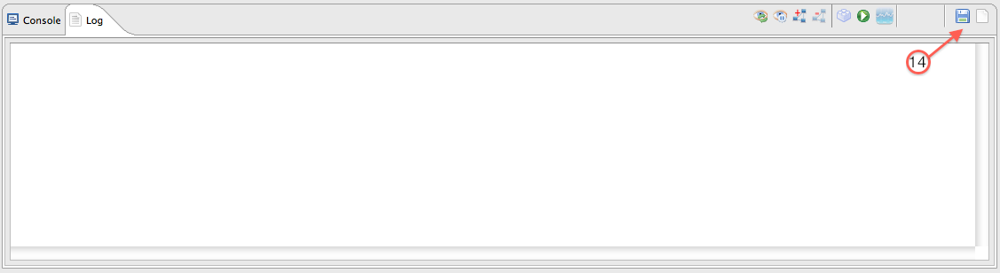
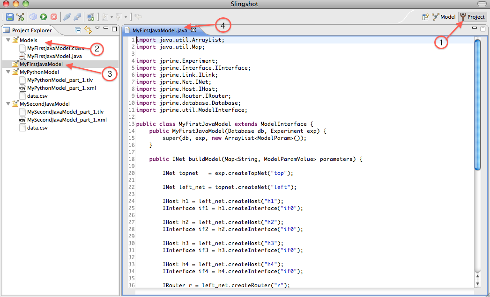
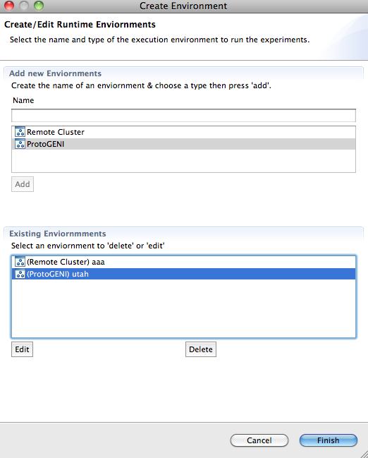

.. meta::
   :description: PrimoGENI User's Guide
   :keywords: PrimoGENI, simulation, emulation, network simulation, network emulation, PRIME, PRIME, SSFNet

.. _slingshot-user-manual-label:

********************************
Slingshot User's Guide
********************************

For details on Slingshot's requirements take a look at :ref:`slingshot-requirements-label`. For details on starting Slingshot for the first time see :ref:`slingshot-running-label`.

=====================================
The Basics
=====================================

Slingshot has two views: *Model* and *Project*. The sections give you the general layout of both views.

.. _slingshot-model-view-label:

--------------------------------------------
The Model View
--------------------------------------------

.. image:: images/slingshot_modelview.png
  :width: 7in

|   

1. **Views:** Slingshot has a :menuselection:`Model` View and a :menuselection:`Project` View; this is the model view.

2. **Network Graph:** Using `prefuse <http://prefuse.org>`_ we are able to display an interactive graph which allows you to view the topology of the network. Different node types have different shapes. When a node is selected it is highlighted in red. Selected nodes are accessible in the console as :samp:`sel`.

3. **Attribute Tree:** The attribute tree allows you to explore the detailed configuration of each model node (i.e., network component), such as assigned IP address of a network interface card in a host, or a link's bandwidth. When the experiment is being executed, the values under :menuselection:`runtime state` will be updated in real time, so you can monitor the network transactions.

4. **Jython Console:** In the console you are able to inspect and modify the model using a subset of `python <http://python.org>`_. We use `jython <http://www.jython.org/>`_ to implement this console. Below are a few important functions/variables that are available in the console; for details on the console see :ref:`slingshot-jython-console-label`. 

  * :samp:`sel` : the currently selected node.
  * :samp:`topnet` : the top-most network.
  * :samp:`exp` : the current experiment (:slingshot:`slingshot::experiment::PyExperiment` not :jprime:`jprime::Experiment`).
  * :samp:`dir` : list important variables/functions available in the console. For those who are familiar with python, :samp:`old_dir()` is the real :samp:`dir()`.
  * :samp:`help` : get information about a node, i.e. :samp:`help(topnet)` or :samp:`help(sel)`.
 
5. **Log:** Informational, warning, and error messages will be displayed here. 
 
6. **Basic Controls:** The left icon is to save the current experiment and the right icon is to create a new experiment.

7. **Experiment Controls (1):** The left icon compiles the model (after a model is compiled it cannot be modified). The middle icon executes the experiment after compilation. The right icon stops the running experiment.

8. **Asynchronous Controls:** These controls allow you to attached and detach slingshot from an active experiment. Currently this functionality is not yet supported.

9. **Execution Environment Controls:** The button is used to create a new execution environment, or to edit or delete an existing execution environment. An execution enviornment contains detailed specification of the platform on which we will run the expeirment.

10. **Visualization Controls:** The first icon redraws the network graph; the second button pauses the real-time update of the network graph (to save CPU time); the third button adds a graph overlay (which is expected to draw on the network graph to show important information, such as the path found by traceroute); and the last button clears out the graph overlays. 

11. **Experiment Controls (2):** The left icon compiles the model. The middle icon executes the experiment. The right icon graphs the runtime state of the currently selected node in realtime using `LiveGraph <http://www.live-graph.org>`_.

12. **Console Controls:** The left icon saves the commands typed in the Jython Console and the right icon allows one to load a set of commands stored in a file to the Jython Console.

13. **View Depth:** You can select the view depth of the network graph. The smaller the value, the higher level representation of the network graph you will see. For example, if you change the view depth from 3 to 2, you will only see the topnet and two subnetworks. The hosts and routers within the two sub networks will not be shown in the graph. 

14. **Log Controls:** The left icon saves the contents of the log to a file and the right icon clear the contents of the log.

.. _slingshot-project-view-label:

--------------------------------------------
Project View
--------------------------------------------

1. **Views:** Slingshot has a :menuselection:`Model` view and a :menuselection:`Project` view; this is the project view. 
2. **Models:** In this tutorial I chose to store my example models in this folder. In general, this folder holds the source topologies generated by Slingshot's internal topology generator.
3. **Project:** Each time an experiment is created a "project" folder is created. The folder can store user files. Additionally, Slingshot will store result files and such in this folder. To open an experiment you need only double click on its project folder.
4. **Editor:** Slingshot's built-in editor can edit xml, java, and python files with minimal syntax highlighting. Otherwise the editor functions as a simple text editor.

========================================================
Creating, Editing, and Exporting Experiments
========================================================

This section details the primary ways to create and edit experiments in Slingshot.

------------------------------------------ 
Importing Models
------------------------------------------ 

Slingshot supports the importation of Java, Class (compiled java), Python, and XML models. To import a model you need to first create a new experiment by selecting the icon next to the disk icon (#6 in :ref:`slingshot-model-view-label`).  You could alternatively select :menuselection:`File --> New --> Experiment`.  You will then be prompted with this dialog:

.. image:: images/slingshot_new_exp_general.png
  :width: 4in

Choose the name of the experiment and enter it on the form. Click :menuselection:`Browse` and choose the model you wish to import. After you click :menuselection:`Finish` it will take a few seconds to load the experiment. The first time you import a model Slingshot needs to load a number of classes and the JVM can be quite slow about this. After the model has been imported it will open the *Model* view for that experiment for you.

------------------------------------------ 
Starting From Scratch
------------------------------------------ 

To create an empty experiment select the icon next to the disk icon as shown above and you will see the new experiment dialog. Enter a name for your experiment and click :menuselection:`Finish`. When the model view opens there will not be a anything displayed in the graph visualization. This is because there is no network topology. The only object that is available is the *experiment*. To start creating your model you need a top-level network, which we call :samp:`topnet`. To create topnet type :samp:`topnet=exp.createTopNet("top")` you will see the following:

  >>> exp.createTopNet("top")
  [Net@15922932902]top
  >>> 

What you see printed has the format **[** *<node type>* **@** *<hash>* **]** *<node name>* . The hash will most likely be different for you. If you type :samp:`topnet` in the console will now see this:

  >>> topnet
  [Net@15922932902]top
  >>> 

The printout should be the same as the previous one. Now we have a topnet you can start adding subnets, hosts, routers, and links. To get help on what functions :samp:`topnet` has just type :samp:`help(topnet)` in the console. In general all the function used to build a java model are available in the console. Additionally, there are python versions of those functions which use named arguments to make it even easier. For more help on creating models take a look at the :ref:`quick-start-label` guide.

As you build your model you can click on the restart visualization icon (#10 in :ref:`slingshot-model-view-label`) to see the current network topology.

.. _slingshot-generator-label:

------------------------------------------ 
Generating Network Topologies
------------------------------------------

To generate a topology select :menuselection:`Tools --> Generate Model` and you will be presented with this dialog:

.. image:: images/slingshot_generate_1.png
  :width: 5in

Enter a name for your model and click next. At this point you should see this dialog:

.. image:: images/slingshot_generate_2.png
  :width: 5in

You should see four different topology generators listed on the left of the dialog. If you do not, that means you have probably forgotten to :samp:`make all` in the *topology* folder of the *primex* directory. The topology generator is just wrapping the external tools found in the topology directory. For details on the specific parameters of each generator please refer to their documentation: `BRITE <http://www.cs.bu.edu/brite/>`_, `INet <http://topology.eecs.umich.edu/inet/>`_, `GT-ITM <http://www.cc.gatech.edu/projects/gtitm/>`_). The topology generators only generate high-level router-topologies. You must attach hosts to these generated networks before you can add traffic and routing.

At this point you have two options: 

* Click :menuselection:`Finish` and the high-level router topology will be created.
* Click the check-box near the bottom the dialog to have the generator automatically attach hosts and subnets to the generated topology. If you select this option you must click :menuselection:`Next`. 
   
  * You will see a small status window appear as the intermediate topology is generated. You then should then be presented with this this dialog:

  .. image:: images/slingshot_generate_3.png
    :width: 5in

  * Fill out the dialog as you see fit. The only thing to explain here is "Automatic duplication of subnets" option. If you choose this then all attached networks will be replicated by copying each other. See :ref:`architecture-replication-label` for details on what it means to be replicated.
  * Click :menuselection:`Finish`

At this point you be back at either the project or model views. If you are in the model view switch to the project
view by click in the model view icon (#5 in :ref:`slingshot-model-view-label`). If you expand
the :menuselection:`Models` folder is the :menuselection:`Project Explorer` you should see an XML
file which contains your generated model. You import this model into Slingshot using the instructions above. 

------------------------------------------ 
Opening, Closing & Deleting Experiments
------------------------------------------

* **Opening** experiments is quite simple. Starting the project view, select the experiment you wish to open in the :menuselection:`Project Explorer`. You can double click on the experiment or use :menuselection:`Experiment --> Open Experiment`. After the experiment is open you will automatically be switched to the model view. If the experiment has not been compiled you can edit it using the console.

* **Closing** experiments can be done in two ways. One method is to select :menuselection:`Experiment --> Close Experiment` while in the model view. The second option is click on the "x" in the experiment's tab in the model view.

.. note:: In either case you may be prompted if you wish to save your model. If you choose not save the experiment this does not delete it; instead you may loose changes. Slingshot automatically persists models to the database in the background. Saving merely flushes all the changes to the database to ensure the model is consistent on disk.

* **Deleting** experiments is done by right clicking on the experiment folder from the :menuselection:`Project Explorer` in the project view and selecting :menuselection:`Delete`.

------------------------------------------ 
Exporting Experiments
------------------------------------------

To export an experiment to an XML file, select :menuselection:`Experiment --> Export Model` and you will see this following dialog:

.. image:: images/slingshot_export_model.png
  :width: 4in

You can enter any filename you wish and slick :menuselection:`Save`.

.. _slingshot-jython-console-label:

=====================================
The Jython Console & Log Window
=====================================

------------------------------------------ 
The Jython Console
------------------------------------------ 

In the console you are able to inspect and modify the model using a subset of `python <http://python.org>`_.  Below are a few important functions and variables that are available in the console.

  * :samp:`sel` : This is the currently selected node. The node will be highlighted in red in the network graph and its properties will be display in the attribute tree.
  * :samp:`topnet` : All models must have a top-most network. This give you direct access to that network. It is also accessible by :samp:`exp.getTopNet()`.
  * :samp:`exp` : The current :slingshot:`PyExperiment  <slingshot::experiment::PyExperiment>` object. The standard :jprime:`Java experiment <jprime::Experiment>` object is available via :samp:`exp.getExperiment()`.
  * :samp:`dir` : :samp:`dir()` lists important variables and functions available in the console. For those who are familiar with python, :samp:`old_dir()` is the original python :samp:`dir()`; our version filters a few unrelated functions and prints them in a prettier format.
  * :samp:`help` : :samp:`help()` retrieves information about a model node, i.e. :samp:`help(topnet)` or :samp:`help(sel)`.

In addition to typing commands directly into the console you are able to:

  * **Save** your command history. To save your command history click on the disk icon in the console command group (#12 in :ref:`slingshot-model-view-label`). You will be prompted for a filename and location to store your command history.
  * **Load** a file of commands (i.e. script) into the console. To load a script click on the folder icon in the console command group (#12 in :ref:`slingshot-model-view-label`). You will be prompted for the script to load. The file will be executed line by line in the console.

------------------------------------------ 
Log Window
------------------------------------------ 

The log window displays information, warning, and error messages that are not shown via dialog boxes. You are able to:

  * **Save** the contents of the log to a file. To save your log click on the disk icon in the log command group (#14 in :ref:`slingshot-model-view-label`). You will be prompted for a filename and location to store your log.
  * **Clear** the contents of the log. To clear your log click on the document icon in the log command group (#14 in :ref:`slingshot-model-view-label`). You will see the following dialog:

    .. image:: images/slingshot_clear_log.png
      :width: 4in

=====================================
Runtime Environments
=====================================

Currently, Slingshot supports three types of execution environments:

* **Local Machine:** This environment can only execute models that contain simulated elements (i.e. no emulation!).
* **Remote Cluster:** This environment assumes that the cluster has been setup to execute PrimoGENI experiments. It differs from the PrimoGENI environment below in that we do not assume the cluster has implemented the GENI api. If you have already allocated a GENI *slice* and the compute nodes are running the PrimoGENI OS image you could run experiments on the slice using this environment type.
* **ProtoGENI:** This environment is to be used when a user has already computational resources available from `ProtoGENI <http://www.protogeni.net/trac/protogeni>`_ .

------------------------------------------ 
Creating Environments
------------------------------------------ 

%%%%%%%%%%%%%%%%%%%%%%%%%%%%%%%%%%%%%%%%%%
Local Environment
%%%%%%%%%%%%%%%%%%%%%%%%%%%%%%%%%%%%%%%%%%
You don't need to create a local environment. When you execute an experiment, you can choose "Local Simulator" as the local environment as shown below. After you click "Next" you can specify the parameters to set up the local environment. 

  .. image:: images/slingshot_local_env.png
    :width: 5in

%%%%%%%%%%%%%%%%%%%%%%%%%%%%%%%%%%%%%%%%%%
ProtoGENI Environment
%%%%%%%%%%%%%%%%%%%%%%%%%%%%%%%%%%%%%%%%%%

.. note:: If you have no idea what ProtoGENI or GENI are it might be best if your first visit the
 `ProtoGENI Tutorial <http://www.protogeni.net/trac/protogeni/wiki/Tutorial>`_.

Before we can create a ProtoGENI environment you need to have a *manifest* resultant from a resource allocation
procedure conducted by the user using `ProtoGENI test scripts <http://www.protogeni.net/trac/protogeni/wiki/TestScripts>`_.
In that website, it is described in detail how to:

1. Obtain an account from Emulab.
2. Download the test scripts and install them.
3. Use these test scripts to allocate an *slice* (a set of computational resources).

In order to get an slice you need a *rspec*, a xml file that describes the resources requested to a ProtoGENI site.
Currently, we have PrimoGENI installed in Utah's ProtoGENI installation. Have in mind that in roder to instantiate
a PrimoGENI experiment we need at least two physical machines: 

1. The **Slave**. The machine that hosts the simulator. If running distributed simulation, you can have multiple slaves.
2. The **Master**. The machine that communicates with slingshot directly and send all commands comming from there to
   all the incumbent slaves.

Also:

 * In the rspec, the slave and Master have to be directly connected to each other.
 * External machines called *portals* can be connected to the slave(s) to serve as external real machines which can 
   be the source or sink of traffic.
   
 Here we show parts of a rspec for allocating one master, one slave, and two external hosts:
 
 .. code-block:: xml
    
    <rspec xmlns="http://www.protogeni.net/resources/rspec/0.2" type="request">
 
    <node virtual_id="externalnode1"
     <disk_image name="urn:publicid:IDN+emulab.net+image+emulab-ops//UBUNTU12-64-STD"/>
     <interface virtual_id="ext1:if0"/>
    </node>

    <node virtual_id="primogeni1"
     <disk_image name="urn:publicid:IDN+emulab.net+image+PRIME//primoGENIv2"/>
     <interface virtual_id="primo1:if0"/>
     <interface virtual_id="primo1:if1"/>
     <interface virtual_id="primo1:if2"/>
    </node>

   <node virtual_id="externalnode2"
    <disk_image name="urn:publicid:IDN+emulab.net+image+emulab-ops//UBUNTU12-64-STD"/>
    <interface virtual_id="ext2:if0"/>
   </node>

   <node virtual_id="primogeni-master"
    <disk_image name="urn:publicid:IDN+emulab.net+image+PRIME//primoGENIv2"/>
    <interface virtual_id="master:if0"/>
   </node>

   <link virtual_id="link1">
    <interface_ref virtual_node_id="externalnode1" virtual_interface_id="ext1:if0" />
    <interface_ref virtual_node_id="primogeni1" virtual_interface_id="primo1:if0" />
   </link>

   <link virtual_id="link2">
    <interface_ref virtual_node_id="primogeni1" virtual_interface_id="primo1:if1" />
    <interface_ref virtual_node_id="primogeni-master" virtual_interface_id="master:if0" />
   </link>

   <link virtual_id="link3">
    <interface_ref virtual_node_id="primogeni1" virtual_interface_id="primo1:if2" />
    <interface_ref virtual_node_id="externalnode2" virtual_interface_id="ext2:if0" />
   </link>

   </rspec>

From the rspec shown above, you can realize that the master (called primogeni-master) and the 
slave (called primogeni1) **must** run the **primoGENIv2** OS image; otherwise they would not be able to bootup
the appropriate processes to talk to slingshot. The external hosts can run any OS image that the experimenter
wants to use. Also, note how the master is directly connected to the master and also the other external hosts
or portals. The complete rspec can be obtained 
`HERE <http://users.cis.fiu.edu/~meraz001/slingshotfiles/utah-4nodes-datanetwork.rspec>`_.

The links for other rspecs:

 * `One master One slave no external hosts <http://users.cis.fiu.edu/~meraz001/slingshotfiles/utah-2nodes-datanetwork-primoimage.rspec>`_.
 * `Four slaves in a single LAN <http://users.cis.fiu.edu/~meraz001/slingshotfiles/utah-4nodes-lan.rspec>`_.

In the process of creating a slice using an rspec which complies to the rules described above, the user
will obtain a *manifest* (a xml like description of the resources obtained). A manifest looks like:
::

   <rspec xmlns="http://www.protogeni.net/resources/rspec/0.2" type="request">
 
   <node virtual_id="externalnode1" exclusive="1" virtualization_type="emulab-vnode" virtualization_subtype="raw" component_urn="urn:publicid:IDN+emulab.net+node+pc277" component_uuid="dea01194-773e-102b-8eb4-001143e453fe" component_manager_urn="urn:publicid:IDN+emulab.net+authority+cm" component_manager_uuid="28a10955-aa00-11dd-ad1f-001143e453fe" hostname="pc277.emulab.net" sshdport="22" sliver_uuid="fea8ee2d-f838-11e1-9f72-001143e453fe" sliver_urn="urn:publicid:IDN+emulab.net+sliver+89180">
      <disk_image name="urn:publicid:IDN+emulab.net+image+emulab-ops//UBUNTU12-64-STD"/>
      <interface virtual_id="ext1:if0" component_id="eth4"/>
      <services><login authentication="ssh-keys" hostname="pc277.emulab.net" port="22" username="merazo"/></services>
   </node>
 
   <node virtual_id="primogeni-master" exclusive="1" virtualization_type="emulab-vnode" virtualization_subtype="raw" component_urn="urn:publicid:IDN+emulab.net+node+pc352" component_uuid="de9f7e79-773e-102b-8eb4-001143e453fe" component_manager_urn="urn:publicid:IDN+emulab.net+authority+cm" component_manager_uuid="28a10955-aa00-11dd-ad1f-001143e453fe" hostname="pc352.emulab.net" sshdport="22" sliver_uuid="02be66d6-f839-11e1-9f72-001143e453fe" sliver_urn="urn:publicid:IDN+emulab.net+sliver+89183">
      <disk_image name="urn:publicid:IDN+emulab.net+image+PRIME//primoGENIv2"/>
      <interface virtual_id="master:if0" component_id="eth4"/>
      <services><login authentication="ssh-keys" hostname="pc352.emulab.net" port="22" username="merazo"/></services>
   </node>
 
   <link virtual_id="link1" sliver_uuid="03592c7b-f839-11e1-9f72-001143e453fe" sliver_urn="urn:publicid:IDN+emulab.net+sliver+89184" vlantag="337">::
      <interface_ref virtual_node_id="externalnode1" virtual_interface_id="ext1:if0" component_urn="urn:publicid:IDN+emulab.net+interface+pc277:eth4" sliver_uuid="0401b6b5-f839-11e1-9f72-001143e453fe" IP="10.10.1.1" sliver_urn="urn:publicid:IDN+emulab.net+sliver+89185" MAC="000423b742d0"/>
      <interface_ref virtual_node_id="primogeni1" virtual_interface_id="primo1:if0" component_urn="urn:publicid:IDN+emulab.net+interface+pc201:eth2" sliver_uuid="05044076-f839-11e1-9f72-001143e453fe" IP="10.10.1.2" sliver_urn="urn:publicid:IDN+emulab.net+sliver+89186" MAC="000423b7176c"/>
   </link>
 
   ...
 
   </rspec>

The *manifest* shown above describes a external node, a primoGENI node, and a link. Slingshot parses the information
to map the experiment to an slice. Copy the manifest from the standard output to a file, manifest.xml for instance, and
you will be ready to create a ProtoGENI environment:

1. Click on *Experiment*.
2. Choose *Create/Edit Environments*.
3. On the pop up window, click in "ProtoGENI" and input the name of the new environment (*utah* for instance).
4. Click on 'Add'.
5. On the new pop up window, click on *Browse* and the select the *manifest.xml* file that you got
   after instantiating the slice using the test scripts as described above.
   
   .. note:: **IMPORTANT!!!** Sometimes our system does not recognize the *master* and the *slave* appropriately. If that
             is the case you may get errors like: *Must select at least one node to be a slave*. For PrimoGENI to run
             we must have at least one node to be a *slave* and one node to be a *master*. So, if you have two
             nodes marked as *master*, then you should make one of them to be a *slave*. The node that you marked 
             as slave in your rspec must be the node that should be marked as slave in slingshot. In our example,
             *primogeni1* node is the slave (it connects to other external nodes) and *primogeni-master* is the
             master (it only connects directly to other slave nodes). The respective IPs of these nodes are
             specified in the *manifest*. Note that both nodes **must** run the *primoGENIv2* OS image as indicated
             in the rspec.
   
6. Click *Finish* twice and the environment will have been created.

%%%%%%%%%%%%%%%%%%%%%%%%%%%%%%%%%%%%%%%%%%
Cluster Environment
%%%%%%%%%%%%%%%%%%%%%%%%%%%%%%%%%%%%%%%%%%

To create a cluster environment follow these steps:

1. Click on the :menuselection:`Create New Environment` icon (#9 in :ref:`slingshot-model-view-label`).
2. Choose the :menuselection:`Remote Cluster` as the :menuselection:`Environment Type` and in the :menuselection:`Environment Name` choose a name.
3. Click :menuselection:`Next`.
4. Input all the IP addresses for compute nodes. 
5. Click :menuselection:`Finish` and the environment will be created.

------------------------------------------ 
Editing & Deleting Environments
------------------------------------------ 

To edit or delete an environment click on the "Create/Edit Environment" icon (#9 in :ref:`slingshot-model-view-label`). Alternatively, you could select :menuselection:`Experiment --> Create/Edit Environment`. In either case, you should see this dialog:

Choose the environment you wish to edit or delete from the list. 

* To **delete** the environment click :menuselection:`Delete`. If the environment was automatically created from a PrimoGENI slice, you will be prompted to delete the slice. If you choose not to delete the slice at this time you must do so manually.
* To **edit** the environment click :menuselection:`Next` and you will be shown the environment's properties so you can edit them. You will see a pop up window like following:

.. image:: images/slingshot_edit_env.png
  :width: 5in

=====================================
Deploying Experiments
=====================================

------------------------------------------ 
Local Environment
------------------------------------------ 

1. Click on the :menuselection:`Execute Experiment` icon (#11 in :ref:`slingshot-model-view-label`). If the
   execute icon is not available you may have to compile first. 
2. Choose *Local Simulator* and click *Next*. You should now see the following dialog:
 
  .. image:: images/slingshot_launching_local.png
    :width: 4in

  There a few things to explain here:

   * **Environment:** The environment which we want to execute the experiment on.
   * **Runtime:** How long to run the experiment for.
   * **Pace Simulation Speed:** Because simulation can execute much faster than real-time we may want to slow down how fast the experiment is executed. If we use :samp:`0` the simulator will run as fast as possible. If we use :samp:`0.5` the simulator will run half as fast as real-time. And if we use :samp:`1` the simulator will run in real-time.
  
3. Click :menuselection:`Finish` and the model will start executing. If you chose to visualize state updates the color of the nodes will change in response to the their `traffic intensity <http://en.wikipedia.org/wiki/Traffic_intensity>`_. The warmer the color the higher the intensity.

------------------------------------------ 
Cluster Environment
------------------------------------------ 

1. Click on the :menuselection:`Execute Experiment` icon (#11 in :ref:`slingshot-model-view-label`). If the execute icon is not available you may have to compile first. 
2. Select a Cluster environment that you previously created.
3. Choose how long you would like the experiment to run.
4. Click :menuselection:`Finish`. 

  .. note:: The meta controllers at the master and slave nodes must be running before the experiment is deployed.

------------------------------------------ 
ProtoGENI Environment
------------------------------------------ 

1. Click on the *Execute Experiment* icon (#11 in :ref:`slingshot-model-view-label`). If the execute icon is not available you may have to compile first. 

2. Select a ProtoGENI environment that you previously created, here we have selected the *[ProtoGENI]utah* environment:
 
  .. image:: images/slingshot_proto_env_1.png
    :width: 4in

3. Click on *Next*.

4. In the popup window, input the *Runtime*; which is the number of seconds the experiment will last. Click on *Next*.

5. Click *Finish*. 

  * After clicking *Finish*, the slingshot will start the mapping of the experiment to the *slice* described in the manifest that you inputted to slingshot.
  * The status of your slice will be printed to the *log* tab during the process, as shown below.
  
  .. image:: images/slingshot_instantiation_messages.png
    :width: 5in
  
  * This process can take a very long time. Be patient.
  * You will be able to redeploy experiments to this environment. 

6. You will be notified once the experiment has begun execution. You will see a dialog like this:

  .. image:: images/slingshot_pg_5.png
    :width: 4in

  .. note:: Sometimes the nodes do not all boot fast enough and the meta-controllers at all of the compute nodes are not ready. If this happens the experiment may fail to start. Don't worry, your time was not wasted. Just redeploy the experiment using the automatically created environment.

7. Once the experiment has been deployed, the simulator starts running the model provided when the experiment is created.

   If your experiment has *emulated hosts* configured, they will be mapped to openvz containers hosted in the physical
   machines running primex, i.e., the *slaves*. They will be configured with private IPs within the space provided when
   the experiment was created. The user can run any application on these containers and in case the traffic is destined
   to *simulated hosts* or other *emulated hosts*, then this will be routed through primex.
   
   In order to log into openvz containers, ssh into the slave machine as described in the manifest you inputted. If
   you do not know the IP of your slave machine, click *Experiment* -> *Create/Edit Environments* and select the
   environment you are currently using and click *Edit*. In the pop up window, the name of the slave machine is shown.
   
   You must know the openvz container ids before logging into them. For example:
   
.. code-block:: console
   
      [root@primogeni1~]# vzlist
      CTID      NPROC STATUS    IP_ADDR         HOSTNAME
        76         13 running   -               host_1001
       237         13 running   -               host_1001
    
Then, you can log in to the container which has the id 76:
   
.. code-block:: console
   
      [root@primogeni1~]# vzctl enter 76
      entered into CT 76
      [root@host_1001 /]# ifconfig
      eth0      Link encap:Ethernet  HWaddr 00:00:00:00:00:37  
                inet addr:192.1.0.9  Bcast:192.1.0.255  Mask:255.255.255.0
                UP BROADCAST RUNNING MULTICAST  MTU:1500  Metric:1
                RX packets:5 errors:0 dropped:0 overruns:0 frame:0
                TX packets:0 errors:0 dropped:0 overruns:0 carrier:0
                collisions:0 txqueuelen:0 
                RX bytes:308 (308.0 b)  TX bytes:0 (0.0 b)
      
You could, for example, start an iperf server:

.. code-block:: console

      [root@host_1001 /]# iperf -s
      ------------------------------------------------------------
      Server listening on TCP port 5001
      TCP window size: 85.3 KByte (default)
      ------------------------------------------------------------
      
On another console, you can log into the other container and start a client:

.. code-block:: console

      [root@primogeni1 ~]# vzctl enter 237
      entered into CT 237
      [root@host_1001 /]# iperf -c 192.1.0.9
          

That traffic will be routed through primex. In you are using the *MyThirdJavaModel.java* your screen would look as
shown below:
   
   .. image:: images/slingshot_iperf_traffic.png
    :width: 4in
    
   The traffic orange and yellow colors show than the traffic is very intense in the links. 
 

 
 
